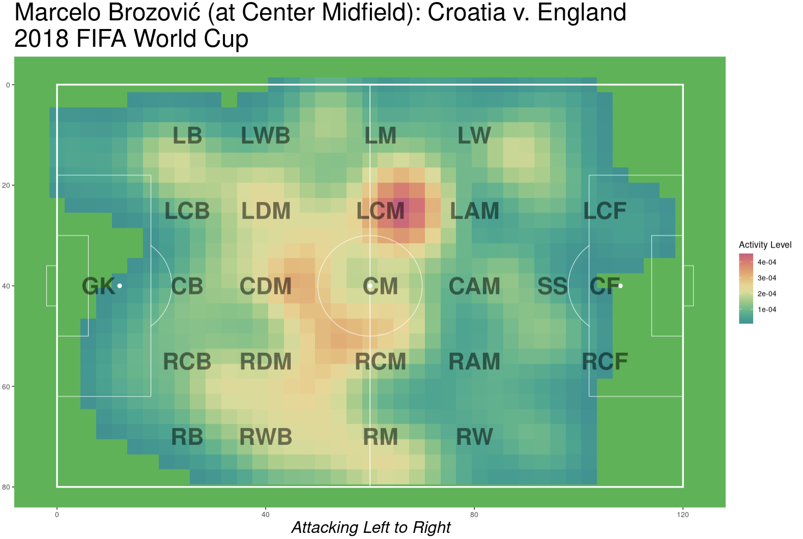

# Executive Summary

*Heat maps* are prominent football visualization tools which illustrate the activity of a player spatially throughout the pitch. Their premise is intuitive: based on a given continuum of colors, the presence of high-valued colors in some region of the field means that the player frequented that area relatively often.

```{r, out.width="90%", out.height="60%", fig.align='center', echo = FALSE}

```

In practice, though, it's unclear how informative these images are. Using a machine learning model (called a Convolutional Neural Network) that can take images as input, we seek to assess how well a football player's position can be correctly identified based on their heat map whilst playing in that position. We train our model using a total of 3042 images, and test its predictive performance on 767 images, splitting our data such that all of the test heat maps are for players from the national teams of Belgium, Croatia, England, and France. The final model we arrive at predicts the positions corresponding to these heat maps with an accuracy of approximately $56.5\%$, with some positions -- such as *Goalkeeper* and *Center Back* -- being predicted at very high rates ($100\%$ and $93\%$, respectively), and others -- such as *Attacking Midfield* and *Right Midfield* -- not so much ($16\%$ each).


