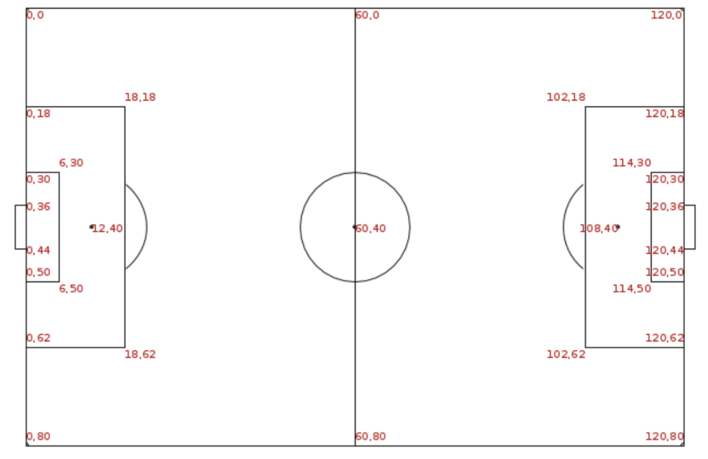
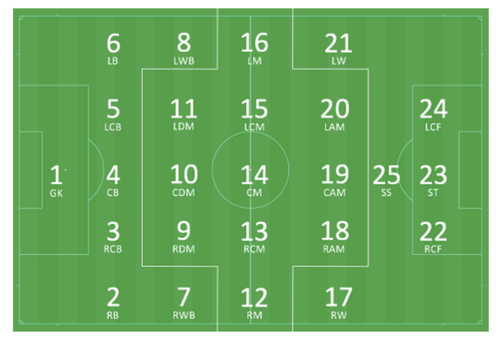

```{r setup, include = FALSE}
knitr::opts_chunk$set(comment = NA,
                      fig.align="center",
                      fig.height = 5,
                      fig.weight = 5)
```

\newpage

# Abstract

Drawing from the data made freely available by [StatsBomb$^1$](https://statsbomb.com/what-we-do/hub/free-data/) (via their [`StatsBombR`$^2$](https://github.com/statsbomb/StatsBombR) package), we craft *heat maps* using event data from the two most-recent major international football competitions: the 2018 FIFA World Cup and the 2020 UEFA European Football Championship (Euros). We experiment with different bandwidths and image resolutions as we generate these heat maps using 2-dimensional Kernel Density Estimation (KDE), subsequently running these heat maps through a Convolutional Neural Network in the effort of predicting the position their corresponding players were playing. We train this classification model on the heat map images of all players not on the Belgian, Croatian, English, or French national teams, as these European nations were uniquely successful in both competitions, and thus serve as a natural test set. Trained on a collection of just over 3000 images, our classifier correctly predicts the positions for unseen heat maps with an accuracy of approximately $56.5\%$. The incorrect predictions made by our model for each position effectively illuminate our football intuition by capturing various circumstantial behaviors and individual tendencies of football teams and players that are often difficult to quantify.

# Introduction

Analyzing football (soccer) using data is, quite naturally, a daunting prospect. For many, to attempt to boil down the intricate dance that is a football match -- one rife with the nuances of human behavior, shrouded in the nebulous, unquantifiable haze of public narrative and personal motivation -- is to seemingly strip the beautiful game of its very beauty. By virtue of football's free-flowing format (two 45-minute halves with sparse stoppages), football analytics are uniquely challenged in that there are no "plays" or "at-bats" that partition the match into standardized events with definite beginnings and ends. This said, there are discrete conventions -- the very tactics that football coaches use to instruct their players and inform their decision-making -- that enable us to achieve analogous categorizations.

One such convention is the notion of *formations*: frameworks which define a team's general shape and positional structure. Knowing the formation a team is playing at any particular moment in a match gives us a rudimentary understanding of that team's strategy and play style. For instance, a *4-4-2* denotes a shape comprised of two wide defenders (a left and right "back"), two central defenders (a left-center back and a right-center back), two wide midfielders (left and right), a left-center midfielder, a right-center midfielder, and two center forwards (left and right). Of course, the rich breadth of variations on the *4-4-2* alone -- such as versions which involve advanced wide midfielders (left/right "wingers"), and versions where the central midfielders are either stationed deeper in order to screen the back-line (defensive midfielders) or sit higher up the pitch to aid the forwards (attacking midfielders) -- underscores the coarseness of the information a formation provides. The same diversity characterizes individual *positions*; just as two teams who play the same formation might deploy slightly different variants in order to fit their personnel, two players who play the same position might exhibit dramatically different behaviors depending on their individual strengths and weaknesses.

*Heat maps* are prominent football visualization tools which illustrate the activity of a player spatially throughout the pitch. Their premise is intuitive: based on a given continuum of colors, the presence of high-valued colors in some region of the field means that the player frequented that area relatively often. However, whether it be due to the opacity underlying the construction of heat maps, or a lack of context often accompanying them, the manner in which football consumers and professionals alike should go about assessing these images in order to draw meaningful conclusions is far from obvious. The method we focus on in this exploratory report is predictive modeling using *Convolutional Neural Networks*. CNNs are a flavor of neural networks that are often used with image-structured data (i.e. 3-dimensional arrays, where the third dimension corresponds to the number of channels in an image; RGB images have 3 such channels). Defined by the use of *convolutional layers* -- layers consisting of arrays of parameters (filters) that are swept (convolved) over the pixels of an image -- CNNs learn the underlying, latent features of the images they are trained on, enabling them to classify novel images with high accuracy.

In __Getting Started__ and __Data Exploration__, we guide the reader through our data retrieval and cleaning process, and point the reader to a custom [R Shiny application$^3$](https://markgjuraj.shinyapps.io/heatmaps/?_ga=2.2166960.1497053111.1651800795-618419299.1650734225) that visualizes the heat maps we create. In __Model Overview and Selection__, our CNN is defined, and the parameters we use to create the heat maps that train the CNN are selected using cross validation. The predictions our CNN makes on our Belgian, Croatian, English, and French heat maps are assessed in __Results__.


# Getting Started

## Dependencies

To replicate our project's results, begin by visiting our GitHub repository [`HeatMapsCapstoneRepo`$^4$](https://github.com/MGjuraj/HeatMapsCapstoneRepo). Download the `data`, `model`, and `R` folders, and ensure that in your current working directory you have an `.Rproj` object. Also check that you have the following libraries installed: 

```{r, message = FALSE, warning = FALSE}
library(shiny)
library(StatsBombR)
library(SDMTools)
library(tidyverse)
library(dplyr)
library(reticulate)
library(ggplot2)
library(MASS)
library(reactable)
library(gridExtra)
library(tensorflow)
library(keras)
library(kableExtra)
```

```{r, echo = FALSE}
setwd(rprojroot::find_rstudio_root_file())
```

The `R` folder houses our R scripts `R/HeatMapRawData.R`, `R/HeatMapPlayerData.R`, `R/HeatMapsCreate.R`, and `R/HeatMapData.R`:

```{r}
source("R/HeatMapRawData.R")
source("R/HeatMapPlayerData.R")
source("R/HeatMapsCreate.R")
source("R/HeatMapData.R")
```

\newpage

# Data Exploration

## Data Retrieval and Overview

The function `get_statsbomb_data()` yields a slew of data frames for both the World Cup and Euros. There is no need to run this function if you've downloaded the `data` folder off of GitHub, as this function is what creates `data/StatsBombData.Rdata`. The function `check_statsbomb_data()` ensures that this `.Rdata` file exists where it should, and instructs you to load it in.

```{r, eval = FALSE, message = FALSE}
get_statsbomb_data()
```

```{r}
check_statsbomb_data()
load("data/StatsBombData.Rdata")
```

* `matches_WC` and `matches_Euros` have 64 and 51 rows respectively, where each observation corresponds to a match. This data frame provides summary information for each match in these competitions. Consult [the following document$^5$](https://github.com/statsbomb/open-data/blob/master/doc/Open%20Data%20Matches%20v3.0.0.pdf) provided by StatsBomb for more information regarding this data's formatting.

* `lineups_WC` and `lineups_Euros` have 128 and 102 rows respectively, where each observation corresponds to a team in a particular match. Nested within each row is another data frame that gives information on each player who was included in that team's squad for that match, and nested within the rows of this data frame are data frames outlining the position(s) that each player played throughout the match. See [the following document$^6$](https://github.com/statsbomb/open-data/blob/master/doc/Open%20Data%20Lineups%20v2.0.0.pdf) provided by StatsBomb for more information regarding this data's formatting.

* `events_WC` and `events_Euros` have 227886 and 192695 rows respectively, where each observation corresponds to a match event. Events include everything from *passes* and *shots* to *duels* and *fouls committed*. The following diagrams, included in [this data's specification$^7$](https://github.com/statsbomb/open-data/blob/master/doc/Open%20Data%20Events%20v4.0.0.pdf) provided by StatsBomb, are essential viewing:

    * __Figure 1 (left)__ serves as a reference for the way in which the location coordinates of each event map onto the pitch. The key takeaway here is that the location data is not absolute: in practice, both teams are attacking in opposite directions, and they switch the goals they are defending at halftime, so having the true locations of each event would not be very informative. StatsBomb accounts for this, thwarting this issue by setting the universal direction of attack as going from left to right.
    
    * __Figure 1 (right)__ illustrates the general conventions for how different positions are defined on paper. If we return to our *4-4-2* example, focusing on the positions that comprise this formation makes the self-explanatory nature of its name apparent, as it consists of a line of 4 players at the back (LB, LCB, RCB, RB), a bank of four in the middle (LM, LCM, RCM, RM), and 2 sitting up top (LCF, RCF).

```{r, echo=FALSE, out.width="49%", out.height="29%", fig.align='center', fig.show='hold', fig.cap = " Pitch Coordinates (Left), Positional Template (Right)"}


``` 

The function `get_involved_players()` yields `data/Players.Rdata`, which possesses three data frames: `allplayers` (4210 rows), `allplayers_WC` (2229 rows), and `allplayers_Euros` (1981 rows). Each row corresponds to a unique player-match-position tuple.

```{r, eval = FALSE, message = FALSE}
get_involved_players()
```

```{r}
check_involved_players()
load("data/Players.Rdata")
```

For example, suppose our individual of focus is the Belgian winger Eden Hazard (our favorite player). Using `allplayers` (or `allplayers_WC`), we can take a look at his World Cup outings:

```{r, echo = FALSE}
hazard_positions <- allplayers_WC %>% 
  filter(playerName == "Eden Hazard") %>%
  dplyr::select(playerID, playerName, matchID, team, involvement, position, n_events)
# reactable(hazard_positions, height = 300)
kbl(hazard_positions, booktabs = T) %>% 
  kable_styling(position = "center", latex_options = c("striped", "hold_position"))
```

Eden Hazard started in every game (in which he appeared) at the World Cup, and in numerous matches he shifted positions in the middle of the match. However, there are instances, such as his stint at *Left Center Forward* against Tunisia in the Group Stage (match 7552), where he was only involved in 18 events. This is a relatively small number of involvements compared to, say, his performance against Japan in the Round of 16 (match 7584), where he stayed at *Left Attacking Midfield* the entire match and was, consequently, highly active (223 events).

This alerts us to the fact that there may be instances where players played positions for such a short period of a particular match that they only had a handful of involvements (if any); we want to account for this, as such observations may make it much more difficult for our CNN to correctly classify these positions.

```{r, echo = FALSE}
zeroes <- allplayers %>% 
  filter(n_events == 0) %>%
  dplyr::select(playerID, playerName, matchID, team, involvement, position, n_events)
# reactable(zeroes, height = 300)
kbl(tail(zeroes, 5), booktabs = T) %>%
  kable_styling(position = "center", latex_options = c("striped", "scale_down", "hold_position"))
```
There are 155 such occasions where a player did not register a single event while playing in a particular position during a particular match. Obviously, we should get rid of these rows, as heat maps cannot be made without events. 

It is noteworthy that, if the following removal step is not done, the functions `get_heatmaps()` and `clean_heatmaps_and_labels()` will deal with these event-less instances accordingly. This will become more clear shortly.

```{r}
allplayers <- allplayers %>%
  filter(n_events != 0)
dim(allplayers)
```

In fact, we will elect to only consider instances where the player had at least 10 involvements in their position throughout the match:

```{r}
allplayers <- allplayers %>%
  filter(n_events >= 10)
dim(allplayers)
```

Football enthusiasts will recall Eden Hazard's stellar performance in the Quarter Finals against Brazil (match 8650). We'll return to this outing in a moment.

## Heat Map Creation and Cleaning

Given $(X_1, Y_1), \cdots, (X_n, Y_n)$, 2-dimensional KDE using Gaussian kernels centers a Gaussian distribution with bandwidth `h` (the standard deviation in both the $X$ and $Y$ direction) on each of these points in 2-dimensional space (the pitch). Essentially, it considers a player's events as observed values -- a sample from their unknown true event distribution -- and seeks to approximate their true distribution through a mixture of Gaussian bumps.

Recall Figure 1's insight into the way in which the field's dimensions are encoded. We know that our location's $X$ values range from 0 to 120, and $Y$ values range from 0 to 80. The novel $X$ and $Y$ values we consider in our KDE are defined by the parameters `x_res` and `y_res`. `x_res = 1`, for example, yields a set of $X$ values $\mathcal{X} = \left(x_{1}, x_{2}, x_{3}, \cdots, x_{119}, x_{120}, x_{121}\right) = \left(0, 1, 2, \cdots, 118, 119, 120\right)$, while `x_res = 10` yields $\mathcal{X} =  \left(x_{1}, x_{2}, x_{3}, \cdots, x_{11}, x_{12}, x_{13}\right) = \left(0, 10, 20, \cdots, 100, 110, 120\right)$. Thus, a larger *resolution* parameter corresponds to less pixels, which is obviously the opposite of the typical notion of image resolution -- aware of this, let's adopt this backward terminology for ease of discussion.

Our 2-dimensional KDE generates a 2-dimensional array -- technically a 3-dimensional array with a single channel -- of size $\large |\mathcal{X}|$ by $\large |\mathcal{Y}|$, where entry $\large(i, j)$ of the array is:

\LARGE
\begin{align*}
\hat{f}(x_i, y_j) &= \frac{1}{n} \sum_{m = 1}^{n} K_h(X_m, x_i) * K_h(Y_m, y_j) \\
&= \frac{1}{n} \sum_{m = 1}^{n} \frac{1}{\sqrt{2\pi}h} e^{\frac{-1}{2}(\frac{X_m - x_i}{h})^2} *\frac{1}{\sqrt{2\pi}h} e^{\frac{-1}{2}(\frac{Y_m - y_j}{h})^2} \\
&= \frac{1}{nh^22\pi} \sum_{m = 1}^{n} e^{\frac{-1}{2} \left((\frac{X_m - x_i}{h})^2 + (\frac{Y_m - y_j}{h})^2 \right)}
\end{align*}
\normalsize

In `R/HeatMapData.R` we find `get_heatmaps()`, which calls upon the data we have loaded into our local environment -- as well as the function `heatmap_KDE()` from `R/HeatMapsCreate.R` -- in order to create a heat map corresponding to every row of `allplayers`. 

Specifically, the function `get_heatmaps()` creates a list of heat map objects (2-dimensional arrays) for each row in `allplayers` given `h`, `x_res` and `y_res`, where very small values ($< 0.00001$) in each heat map array are zeroed-out. Each array is also normalized so that its values lie between $0$ and $1$. 

We create heat maps for a handful of different combinations of bandwidth and resolution:

```{r, cache = TRUE, eval = FALSE}
dirty_heatmaps_3_1 <- get_heatmaps(h = 3, x_res = 1, y_res = 1)
dirty_heatmaps_3_3 <- get_heatmaps(h = 3, x_res = 3, y_res = 3)
dirty_heatmaps_3_6 <- get_heatmaps(h = 3, x_res = 6, y_res = 6)
dirty_heatmaps_5_1 <- get_heatmaps(h = 5, x_res = 1, y_res = 1)
dirty_heatmaps_5_3 <- get_heatmaps(h = 5, x_res = 3, y_res = 3)
dirty_heatmaps_5_6 <- get_heatmaps(h = 5, x_res = 6, y_res = 6)
dirty_heatmaps_10_1 <- get_heatmaps(h = 10, x_res = 1, y_res = 1)
dirty_heatmaps_10_3 <- get_heatmaps(h = 10, x_res = 3, y_res = 3)
dirty_heatmaps_10_6 <- get_heatmaps(h = 10, x_res = 6, y_res = 6)
```

```{r, echo = FALSE, eval = FALSE}
save(dirty_heatmaps_3_1, file = "data/dirty_heatmaps_3_1.Rdata")
save(dirty_heatmaps_3_3, file = "data/dirty_heatmaps_3_3.Rdata")
save(dirty_heatmaps_3_6, file = "data/dirty_heatmaps_3_6.Rdata")
save(dirty_heatmaps_5_1, file = "data/dirty_heatmaps_5_1.Rdata")
save(dirty_heatmaps_5_3, file = "data/dirty_heatmaps_5_3.Rdata")
save(dirty_heatmaps_5_6, file = "data/dirty_heatmaps_5_6.Rdata")
save(dirty_heatmaps_10_1, file = "data/dirty_heatmaps_10_1.Rdata")
save(dirty_heatmaps_10_3, file = "data/dirty_heatmaps_10_3.Rdata")
save(dirty_heatmaps_10_6, file = "data/dirty_heatmaps_10_6.Rdata")
```

```{r, echo = FALSE}
load("data/dirty_heatmaps_3_1.Rdata")
load("data/dirty_heatmaps_3_3.Rdata")
load("data/dirty_heatmaps_3_6.Rdata")
load("data/dirty_heatmaps_5_1.Rdata")
load("data/dirty_heatmaps_5_3.Rdata")
load("data/dirty_heatmaps_5_6.Rdata")
load("data/dirty_heatmaps_10_1.Rdata")
load("data/dirty_heatmaps_10_3.Rdata")
load("data/dirty_heatmaps_10_6.Rdata")
```

The function `clean_heatmaps_and_labels()` takes a list of "dirty" heat maps and re-formats it as an array of arrays, while also returning a vector of labels (the positions corresponding to these heat maps) and a vector of row indices that allow us to refer back to `allplayers`. As mentioned above, since we removed our undesirable rows from `allplayers` beforehand, this vector of indices is not particularly useful; this function deals with event-less heat maps by keeping track of which rows of `allplayers` have a non-zero number of events, but if we preemptively remove event-less observations from `allplayers`, then every row will have a defined heat map, making this practice unnecessary.

```{r, cache = TRUE}
clean_heatmaps_3_1 <- clean_heatmaps_and_labels(dirty_heatmaps_3_1)
clean_heatmaps_3_3 <- clean_heatmaps_and_labels(dirty_heatmaps_3_3)
clean_heatmaps_3_6 <- clean_heatmaps_and_labels(dirty_heatmaps_3_6)
clean_heatmaps_5_1 <- clean_heatmaps_and_labels(dirty_heatmaps_5_1)
clean_heatmaps_5_3 <- clean_heatmaps_and_labels(dirty_heatmaps_5_3)
clean_heatmaps_5_6 <- clean_heatmaps_and_labels(dirty_heatmaps_5_6)
clean_heatmaps_10_1 <- clean_heatmaps_and_labels(dirty_heatmaps_10_1)
clean_heatmaps_10_3 <- clean_heatmaps_and_labels(dirty_heatmaps_10_3)
clean_heatmaps_10_6 <- clean_heatmaps_and_labels(dirty_heatmaps_10_6)
```

```{r, echo = FALSE, eval = FALSE}
str(clean_heatmaps_3_1)
```

```{r, echo = FALSE}
positions_comp <- t(as.matrix(table(clean_heatmaps_3_1$positions)))
rownames(positions_comp) <- "# of Heat Maps"
positions_comp <- as.data.frame(positions_comp)
kbl(positions_comp[, 1:5], booktabs = T) %>%
  kable_styling(latex_options = c("striped", "scale_down", "hold_position"))
kbl(positions_comp[, 6:10], booktabs = T) %>%
  kable_styling(latex_options = c("scale_down", "hold_position"))
kbl(positions_comp[, 11:15], booktabs = T) %>%
  kable_styling(latex_options = c("striped", "scale_down", "hold_position"))
kbl(positions_comp[, 16:20], booktabs = T) %>%
  kable_styling(latex_options = c("scale_down", "hold_position"))
kbl(positions_comp[, 21:25], booktabs = T) %>%
  kable_styling(latex_options = c("striped", "scale_down", "hold_position"))
```

In the table above, we can see the composition of our position labels. There is a clear lack of balance in terms of the positions we have heat map data for, and because we only have 3809 total heat maps, this disparity in our sample sizes suggests that we should re-categorize these positions into more generalized buckets. We elect to do so by grouping together positions that we believe, in practice, tend to correspond to the same fundamental roles in the broader context of the team unit:

\begin{align*}
\text{Left Wing Back } &\rightarrow \text{ Left Midfield} \\
\text{Right Wing Back } &\rightarrow \text{ Right Midfield} \\
\text{Left Center Back, Right Center Back } &\rightarrow \text{ Center Back} \\
\text{Left Defensive Midfield, Right Defensive Midfield, Center Defensive Midfield } &\rightarrow \text{ Defensive Midfield} \\
\text{Left Center Midfield, Right Center Midfield } &\rightarrow \text{ Center Midfield} \\
\text{Left Attacking Midfield, Right Attacking Midfield, Center Attacking Midfield } &\rightarrow \text{ Attacking Midfield} \\
\text{Left Wing, Left Center Forward } &\rightarrow \text{ Left Forward} \\
\text{Right Wing, Right Center Forward } &\rightarrow \text{ Right Forward} \\
\text{Secondary Striker } &\rightarrow \text{ Center Forward} \\
\end{align*}

The result is a shrinkage in our number of position classes from 25 to 12:

```{r, echo = FALSE}
clean_heatmaps_3_1$class <- clean_heatmaps_3_1$positions
clean_heatmaps_3_1$class <- gsub("Left Wing Back", "Left Midfield", 
                                 clean_heatmaps_3_1$class)
clean_heatmaps_3_1$class <- gsub("Right Wing Back", "Right Midfield", 
                                 clean_heatmaps_3_1$class)
clean_heatmaps_3_1$class <- gsub("Left Center Back", "Center Back", 
                                 clean_heatmaps_3_1$class)
clean_heatmaps_3_1$class <- gsub("Right Center Back", "Center Back", 
                                 clean_heatmaps_3_1$class)
clean_heatmaps_3_1$class <- gsub("Left Defensive Midfield", "Defensive Midfield", 
                                 clean_heatmaps_3_1$class)
clean_heatmaps_3_1$class <- gsub("Right Defensive Midfield", "Defensive Midfield", 
                                 clean_heatmaps_3_1$class)
clean_heatmaps_3_1$class <- gsub("Center Defensive Midfield", "Defensive Midfield", 
                                 clean_heatmaps_3_1$class)
clean_heatmaps_3_1$class <- gsub("Left Wing", "Left Forward", 
                                 clean_heatmaps_3_1$class)
clean_heatmaps_3_1$class <- gsub("Left Center Forward", "Left Forward", 
                                 clean_heatmaps_3_1$class)
clean_heatmaps_3_1$class <- gsub("Right Wing", "Right Forward", 
                                 clean_heatmaps_3_1$class)
clean_heatmaps_3_1$class <- gsub("Right Center Forward", "Right Forward", 
                                 clean_heatmaps_3_1$class)
clean_heatmaps_3_1$class <- gsub("Secondary Striker", "Center Forward", 
                                 clean_heatmaps_3_1$class)
clean_heatmaps_3_1$class <- gsub("Left Attacking Midfield", "Attacking Midfield", 
                                 clean_heatmaps_3_1$class)
clean_heatmaps_3_1$class <- gsub("Center Attacking Midfield", "Attacking Midfield", 
                                 clean_heatmaps_3_1$class)
clean_heatmaps_3_1$class <- gsub("Right Attacking Midfield", "Attacking Midfield", 
                                 clean_heatmaps_3_1$class)
clean_heatmaps_3_1$class <- gsub("Left Center Midfield", "Center Midfield", 
                                 clean_heatmaps_3_1$class)
clean_heatmaps_3_1$class <- gsub("Right Center Midfield", "Center Midfield", 
                                 clean_heatmaps_3_1$class)
clean_heatmaps_3_1$class <- as.factor(clean_heatmaps_3_1$class)
```

```{r, echo = FALSE}
positions_comp <- t(as.matrix(table(clean_heatmaps_3_1$class)))
rownames(positions_comp) <- "# of Heat Maps"
positions_comp <- as.data.frame(positions_comp)
kbl(positions_comp[, 1:6], booktabs = T) %>%
  kable_styling(latex_options = c("striped", "scale_down", "hold_position"))
kbl(positions_comp[, 7:12], booktabs = T) %>%
  kable_styling(latex_options = c("scale_down", "hold_position"))
```

Evidently, for each position we now have at least ~200 observations, making us much more confident that our CNN will see enough of each position to be able to learn their latent features and subsequently classify novel heat maps with high accuracy.

```{r, echo = FALSE}
clean_heatmaps_3_3$class <- clean_heatmaps_3_3$positions
clean_heatmaps_3_3$class <- gsub("Left Wing Back", "Left Midfield", clean_heatmaps_3_3$class)
clean_heatmaps_3_3$class <- gsub("Right Wing Back", "Right Midfield", clean_heatmaps_3_3$class)
clean_heatmaps_3_3$class <- gsub("Left Center Back", "Center Back", clean_heatmaps_3_3$class)
clean_heatmaps_3_3$class <- gsub("Right Center Back", "Center Back", clean_heatmaps_3_3$class)
clean_heatmaps_3_3$class <- gsub("Left Defensive Midfield", "Defensive Midfield", clean_heatmaps_3_3$class)
clean_heatmaps_3_3$class <- gsub("Right Defensive Midfield", "Defensive Midfield", clean_heatmaps_3_3$class)
clean_heatmaps_3_3$class <- gsub("Center Defensive Midfield", "Defensive Midfield", clean_heatmaps_3_3$class)
clean_heatmaps_3_3$class <- gsub("Left Wing", "Left Forward", clean_heatmaps_3_3$class)
clean_heatmaps_3_3$class <- gsub("Left Center Forward", "Left Forward", clean_heatmaps_3_3$class)
clean_heatmaps_3_3$class <- gsub("Right Wing", "Right Forward", clean_heatmaps_3_3$class)
clean_heatmaps_3_3$class <- gsub("Right Center Forward", "Right Forward", clean_heatmaps_3_3$class)
clean_heatmaps_3_3$class <- gsub("Secondary Striker", "Center Forward", clean_heatmaps_3_3$class)
clean_heatmaps_3_3$class <- gsub("Left Attacking Midfield", "Attacking Midfield", clean_heatmaps_3_3$class)
clean_heatmaps_3_3$class <- gsub("Center Attacking Midfield", "Attacking Midfield", clean_heatmaps_3_3$class)
clean_heatmaps_3_3$class <- gsub("Right Attacking Midfield", "Attacking Midfield", clean_heatmaps_3_3$class)
clean_heatmaps_3_3$class <- gsub("Left Center Midfield", "Center Midfield", clean_heatmaps_3_3$class)
clean_heatmaps_3_3$class <- gsub("Right Center Midfield", "Center Midfield", clean_heatmaps_3_3$class)
clean_heatmaps_3_3$class <- as.factor(clean_heatmaps_3_3$class)

clean_heatmaps_3_6$class <- clean_heatmaps_3_6$positions
clean_heatmaps_3_6$class <- gsub("Left Wing Back", "Left Midfield", clean_heatmaps_3_6$class)
clean_heatmaps_3_6$class <- gsub("Right Wing Back", "Right Midfield", clean_heatmaps_3_6$class)
clean_heatmaps_3_6$class <- gsub("Left Center Back", "Center Back", clean_heatmaps_3_6$class)
clean_heatmaps_3_6$class <- gsub("Right Center Back", "Center Back", clean_heatmaps_3_6$class)
clean_heatmaps_3_6$class <- gsub("Left Defensive Midfield", "Defensive Midfield", clean_heatmaps_3_6$class)
clean_heatmaps_3_6$class <- gsub("Right Defensive Midfield", "Defensive Midfield", clean_heatmaps_3_6$class)
clean_heatmaps_3_6$class <- gsub("Center Defensive Midfield", "Defensive Midfield", clean_heatmaps_3_6$class)
clean_heatmaps_3_6$class <- gsub("Left Wing", "Left Forward", clean_heatmaps_3_6$class)
clean_heatmaps_3_6$class <- gsub("Left Center Forward", "Left Forward", clean_heatmaps_3_6$class)
clean_heatmaps_3_6$class <- gsub("Right Wing", "Right Forward", clean_heatmaps_3_6$class)
clean_heatmaps_3_6$class <- gsub("Right Center Forward", "Right Forward", clean_heatmaps_3_6$class)
clean_heatmaps_3_6$class <- gsub("Secondary Striker", "Center Forward", clean_heatmaps_3_6$class)
clean_heatmaps_3_6$class <- gsub("Left Attacking Midfield", "Attacking Midfield", clean_heatmaps_3_6$class)
clean_heatmaps_3_6$class <- gsub("Center Attacking Midfield", "Attacking Midfield", clean_heatmaps_3_6$class)
clean_heatmaps_3_6$class <- gsub("Right Attacking Midfield", "Attacking Midfield", clean_heatmaps_3_6$class)
clean_heatmaps_3_6$class <- gsub("Left Center Midfield", "Center Midfield", clean_heatmaps_3_6$class)
clean_heatmaps_3_6$class <- gsub("Right Center Midfield", "Center Midfield", clean_heatmaps_3_6$class)
clean_heatmaps_3_6$class <- as.factor(clean_heatmaps_3_6$class)

clean_heatmaps_5_1$class <- clean_heatmaps_5_1$positions
clean_heatmaps_5_1$class <- gsub("Left Wing Back", "Left Midfield", clean_heatmaps_5_1$class)
clean_heatmaps_5_1$class <- gsub("Right Wing Back", "Right Midfield", clean_heatmaps_5_1$class)
clean_heatmaps_5_1$class <- gsub("Left Center Back", "Center Back", clean_heatmaps_5_1$class)
clean_heatmaps_5_1$class <- gsub("Right Center Back", "Center Back", clean_heatmaps_5_1$class)
clean_heatmaps_5_1$class <- gsub("Left Defensive Midfield", "Defensive Midfield", clean_heatmaps_5_1$class)
clean_heatmaps_5_1$class <- gsub("Right Defensive Midfield", "Defensive Midfield", clean_heatmaps_5_1$class)
clean_heatmaps_5_1$class <- gsub("Center Defensive Midfield", "Defensive Midfield", clean_heatmaps_5_1$class)
clean_heatmaps_5_1$class <- gsub("Left Wing", "Left Forward", clean_heatmaps_5_1$class)
clean_heatmaps_5_1$class <- gsub("Left Center Forward", "Left Forward", clean_heatmaps_5_1$class)
clean_heatmaps_5_1$class <- gsub("Right Wing", "Right Forward", clean_heatmaps_5_1$class)
clean_heatmaps_5_1$class <- gsub("Right Center Forward", "Right Forward", clean_heatmaps_5_1$class)
clean_heatmaps_5_1$class <- gsub("Secondary Striker", "Center Forward", clean_heatmaps_5_1$class)
clean_heatmaps_5_1$class <- gsub("Left Attacking Midfield", "Attacking Midfield", clean_heatmaps_5_1$class)
clean_heatmaps_5_1$class <- gsub("Center Attacking Midfield", "Attacking Midfield", clean_heatmaps_5_1$class)
clean_heatmaps_5_1$class <- gsub("Right Attacking Midfield", "Attacking Midfield", clean_heatmaps_5_1$class)
clean_heatmaps_5_1$class <- gsub("Left Center Midfield", "Center Midfield", clean_heatmaps_5_1$class)
clean_heatmaps_5_1$class <- gsub("Right Center Midfield", "Center Midfield", clean_heatmaps_5_1$class)
clean_heatmaps_5_1$class <- as.factor(clean_heatmaps_5_1$class)

clean_heatmaps_5_3$class <- clean_heatmaps_5_3$positions
clean_heatmaps_5_3$class <- gsub("Left Wing Back", "Left Midfield", clean_heatmaps_5_3$class)
clean_heatmaps_5_3$class <- gsub("Right Wing Back", "Right Midfield", clean_heatmaps_5_3$class)
clean_heatmaps_5_3$class <- gsub("Left Center Back", "Center Back", clean_heatmaps_5_3$class)
clean_heatmaps_5_3$class <- gsub("Right Center Back", "Center Back", clean_heatmaps_5_3$class)
clean_heatmaps_5_3$class <- gsub("Left Defensive Midfield", "Defensive Midfield", clean_heatmaps_5_3$class)
clean_heatmaps_5_3$class <- gsub("Right Defensive Midfield", "Defensive Midfield", clean_heatmaps_5_3$class)
clean_heatmaps_5_3$class <- gsub("Center Defensive Midfield", "Defensive Midfield", clean_heatmaps_5_3$class)
clean_heatmaps_5_3$class <- gsub("Left Wing", "Left Forward", clean_heatmaps_5_3$class)
clean_heatmaps_5_3$class <- gsub("Left Center Forward", "Left Forward", clean_heatmaps_5_3$class)
clean_heatmaps_5_3$class <- gsub("Right Wing", "Right Forward", clean_heatmaps_5_3$class)
clean_heatmaps_5_3$class <- gsub("Right Center Forward", "Right Forward", clean_heatmaps_5_3$class)
clean_heatmaps_5_3$class <- gsub("Secondary Striker", "Center Forward", clean_heatmaps_5_3$class)
clean_heatmaps_5_3$class <- gsub("Left Attacking Midfield", "Attacking Midfield", clean_heatmaps_5_3$class)
clean_heatmaps_5_3$class <- gsub("Center Attacking Midfield", "Attacking Midfield", clean_heatmaps_5_3$class)
clean_heatmaps_5_3$class <- gsub("Right Attacking Midfield", "Attacking Midfield", clean_heatmaps_5_3$class)
clean_heatmaps_5_3$class <- gsub("Left Center Midfield", "Center Midfield", clean_heatmaps_5_3$class)
clean_heatmaps_5_3$class <- gsub("Right Center Midfield", "Center Midfield", clean_heatmaps_5_3$class)
clean_heatmaps_5_3$class <- as.factor(clean_heatmaps_5_3$class)

clean_heatmaps_5_6$class <- clean_heatmaps_5_6$positions
clean_heatmaps_5_6$class <- gsub("Left Wing Back", "Left Midfield", clean_heatmaps_5_6$class)
clean_heatmaps_5_6$class <- gsub("Right Wing Back", "Right Midfield", clean_heatmaps_5_6$class)
clean_heatmaps_5_6$class <- gsub("Left Center Back", "Center Back", clean_heatmaps_5_6$class)
clean_heatmaps_5_6$class <- gsub("Right Center Back", "Center Back", clean_heatmaps_5_6$class)
clean_heatmaps_5_6$class <- gsub("Left Defensive Midfield", "Defensive Midfield", clean_heatmaps_5_6$class)
clean_heatmaps_5_6$class <- gsub("Right Defensive Midfield", "Defensive Midfield", clean_heatmaps_5_6$class)
clean_heatmaps_5_6$class <- gsub("Center Defensive Midfield", "Defensive Midfield", clean_heatmaps_5_6$class)
clean_heatmaps_5_6$class <- gsub("Left Wing", "Left Forward", clean_heatmaps_5_6$class)
clean_heatmaps_5_6$class <- gsub("Left Center Forward", "Left Forward", clean_heatmaps_5_6$class)
clean_heatmaps_5_6$class <- gsub("Right Wing", "Right Forward", clean_heatmaps_5_6$class)
clean_heatmaps_5_6$class <- gsub("Right Center Forward", "Right Forward", clean_heatmaps_5_6$class)
clean_heatmaps_5_6$class <- gsub("Secondary Striker", "Center Forward", clean_heatmaps_5_6$class)
clean_heatmaps_5_6$class <- gsub("Left Attacking Midfield", "Attacking Midfield", clean_heatmaps_5_6$class)
clean_heatmaps_5_6$class <- gsub("Center Attacking Midfield", "Attacking Midfield", clean_heatmaps_5_6$class)
clean_heatmaps_5_6$class <- gsub("Right Attacking Midfield", "Attacking Midfield", clean_heatmaps_5_6$class)
clean_heatmaps_5_6$class <- gsub("Left Center Midfield", "Center Midfield", clean_heatmaps_5_6$class)
clean_heatmaps_5_6$class <- gsub("Right Center Midfield", "Center Midfield", clean_heatmaps_5_6$class)
clean_heatmaps_5_6$class <- as.factor(clean_heatmaps_5_6$class)

clean_heatmaps_10_1$class <- clean_heatmaps_10_1$positions
clean_heatmaps_10_1$class <- gsub("Left Wing Back", "Left Midfield", clean_heatmaps_10_1$class)
clean_heatmaps_10_1$class <- gsub("Right Wing Back", "Right Midfield", clean_heatmaps_10_1$class)
clean_heatmaps_10_1$class <- gsub("Left Center Back", "Center Back", clean_heatmaps_10_1$class)
clean_heatmaps_10_1$class <- gsub("Right Center Back", "Center Back", clean_heatmaps_10_1$class)
clean_heatmaps_10_1$class <- gsub("Left Defensive Midfield", "Defensive Midfield", clean_heatmaps_10_1$class)
clean_heatmaps_10_1$class <- gsub("Right Defensive Midfield", "Defensive Midfield", clean_heatmaps_10_1$class)
clean_heatmaps_10_1$class <- gsub("Center Defensive Midfield", "Defensive Midfield", clean_heatmaps_10_1$class)
clean_heatmaps_10_1$class <- gsub("Left Wing", "Left Forward", clean_heatmaps_10_1$class)
clean_heatmaps_10_1$class <- gsub("Left Center Forward", "Left Forward", clean_heatmaps_10_1$class)
clean_heatmaps_10_1$class <- gsub("Right Wing", "Right Forward", clean_heatmaps_10_1$class)
clean_heatmaps_10_1$class <- gsub("Right Center Forward", "Right Forward", clean_heatmaps_10_1$class)
clean_heatmaps_10_1$class <- gsub("Secondary Striker", "Center Forward", clean_heatmaps_10_1$class)
clean_heatmaps_10_1$class <- gsub("Left Attacking Midfield", "Attacking Midfield", clean_heatmaps_10_1$class)
clean_heatmaps_10_1$class <- gsub("Center Attacking Midfield", "Attacking Midfield", clean_heatmaps_10_1$class)
clean_heatmaps_10_1$class <- gsub("Right Attacking Midfield", "Attacking Midfield", clean_heatmaps_10_1$class)
clean_heatmaps_10_1$class <- gsub("Left Center Midfield", "Center Midfield", clean_heatmaps_10_1$class)
clean_heatmaps_10_1$class <- gsub("Right Center Midfield", "Center Midfield", clean_heatmaps_10_1$class)
clean_heatmaps_10_1$class <- as.factor(clean_heatmaps_10_1$class)

clean_heatmaps_10_3$class <- clean_heatmaps_10_3$positions
clean_heatmaps_10_3$class <- gsub("Left Wing Back", "Left Midfield", clean_heatmaps_10_3$class)
clean_heatmaps_10_3$class <- gsub("Right Wing Back", "Right Midfield", clean_heatmaps_10_3$class)
clean_heatmaps_10_3$class <- gsub("Left Center Back", "Center Back", clean_heatmaps_10_3$class)
clean_heatmaps_10_3$class <- gsub("Right Center Back", "Center Back", clean_heatmaps_10_3$class)
clean_heatmaps_10_3$class <- gsub("Left Defensive Midfield", "Defensive Midfield", clean_heatmaps_10_3$class)
clean_heatmaps_10_3$class <- gsub("Right Defensive Midfield", "Defensive Midfield", clean_heatmaps_10_3$class)
clean_heatmaps_10_3$class <- gsub("Center Defensive Midfield", "Defensive Midfield", clean_heatmaps_10_3$class)
clean_heatmaps_10_3$class <- gsub("Left Wing", "Left Forward", clean_heatmaps_10_3$class)
clean_heatmaps_10_3$class <- gsub("Left Center Forward", "Left Forward", clean_heatmaps_10_3$class)
clean_heatmaps_10_3$class <- gsub("Right Wing", "Right Forward", clean_heatmaps_10_3$class)
clean_heatmaps_10_3$class <- gsub("Right Center Forward", "Right Forward", clean_heatmaps_10_3$class)
clean_heatmaps_10_3$class <- gsub("Secondary Striker", "Center Forward", clean_heatmaps_10_3$class)
clean_heatmaps_10_3$class <- gsub("Left Attacking Midfield", "Attacking Midfield", clean_heatmaps_10_3$class)
clean_heatmaps_10_3$class <- gsub("Center Attacking Midfield", "Attacking Midfield", clean_heatmaps_10_3$class)
clean_heatmaps_10_3$class <- gsub("Right Attacking Midfield", "Attacking Midfield", clean_heatmaps_10_3$class)
clean_heatmaps_10_3$class <- gsub("Left Center Midfield", "Center Midfield", clean_heatmaps_10_3$class)
clean_heatmaps_10_3$class <- gsub("Right Center Midfield", "Center Midfield", clean_heatmaps_10_3$class)
clean_heatmaps_10_3$class <- as.factor(clean_heatmaps_10_3$class)

clean_heatmaps_10_6$class <- clean_heatmaps_10_6$positions
clean_heatmaps_10_6$class <- gsub("Left Wing Back", "Left Midfield", clean_heatmaps_10_6$class)
clean_heatmaps_10_6$class <- gsub("Right Wing Back", "Right Midfield", clean_heatmaps_10_6$class)
clean_heatmaps_10_6$class <- gsub("Left Center Back", "Center Back", clean_heatmaps_10_6$class)
clean_heatmaps_10_6$class <- gsub("Right Center Back", "Center Back", clean_heatmaps_10_6$class)
clean_heatmaps_10_6$class <- gsub("Left Defensive Midfield", "Defensive Midfield", clean_heatmaps_10_6$class)
clean_heatmaps_10_6$class <- gsub("Right Defensive Midfield", "Defensive Midfield", clean_heatmaps_10_6$class)
clean_heatmaps_10_6$class <- gsub("Center Defensive Midfield", "Defensive Midfield", clean_heatmaps_10_6$class)
clean_heatmaps_10_6$class <- gsub("Left Wing", "Left Forward", clean_heatmaps_10_6$class)
clean_heatmaps_10_6$class <- gsub("Left Center Forward", "Left Forward", clean_heatmaps_10_6$class)
clean_heatmaps_10_6$class <- gsub("Right Wing", "Right Forward", clean_heatmaps_10_6$class)
clean_heatmaps_10_6$class <- gsub("Right Center Forward", "Right Forward", clean_heatmaps_10_6$class)
clean_heatmaps_10_6$class <- gsub("Secondary Striker", "Center Forward", clean_heatmaps_10_6$class)
clean_heatmaps_10_6$class <- gsub("Left Attacking Midfield", "Attacking Midfield", clean_heatmaps_10_6$class)
clean_heatmaps_10_6$class <- gsub("Center Attacking Midfield", "Attacking Midfield", clean_heatmaps_10_6$class)
clean_heatmaps_10_6$class <- gsub("Right Attacking Midfield", "Attacking Midfield", clean_heatmaps_10_6$class)
clean_heatmaps_10_6$class <- gsub("Left Center Midfield", "Center Midfield", clean_heatmaps_10_6$class)
clean_heatmaps_10_6$class <- gsub("Right Center Midfield", "Center Midfield", clean_heatmaps_10_6$class)
clean_heatmaps_10_6$class <- as.factor(clean_heatmaps_10_6$class)
```

\newpage

## Heat Map Visualization and Shiny Application

The function `heatmap_plotter()` defined in `R/HeatMapsCreate.R` allows us to visualize the heat map arrays. Figure 2 below shows six heat maps corresponding to Eden Hazard's activity while playing *Left Wing* against Brazil in the World Cup *Quarter Finals*. From the top left to the middle left, a bandwidth `h = 5` is used for each heat map, while the number of pixels decreases as we move from left to right. Starting from the middle right, a resolution `res_x, res_y = 3` is used for each heat map, while the bandwidth increases from left to right.

```{r, fig.width = 24, fig.height = 6, eval = FALSE}
p1 <- heatmap_plotter(heatmaps_data = clean_heatmaps_5_1, matchid = 8650, playerid = 3621, 
                      pos = "Left Wing", res_x = 1, res_y = 1)
p2 <- heatmap_plotter(heatmaps_data = clean_heatmaps_5_3, matchid = 8650, playerid = 3621, 
                      pos = "Left Wing", res_x = 3, res_y = 3)
p3 <- heatmap_plotter(heatmaps_data = clean_heatmaps_5_6, matchid = 8650, playerid = 3621, 
                      pos = "Left Wing", res_x = 6, res_y = 6)
p4 <- heatmap_plotter(heatmaps_data = clean_heatmaps_3_3, matchid = 8650, playerid = 3621, 
                      pos = "Left Wing", res_x = 3, res_y = 3)
p5 <- heatmap_plotter(heatmaps_data = clean_heatmaps_5_3, matchid = 8650, playerid = 3621, 
                      pos = "Left Wing", res_x = 3, res_y = 3)
p6 <- heatmap_plotter(heatmaps_data = clean_heatmaps_10_3, matchid = 8650, playerid = 3621, 
                      pos = "Left Wing", res_x = 3, res_y = 3)
```

```{r, fig.width = 24, fig.height = 24, echo = FALSE, fig.cap= " Eden Hazard at Left Wing in Match 8650"}
p1 <- heatmap_plotter(heatmaps_data = clean_heatmaps_5_1, matchid = 8650, playerid = 3621, 
                      pos = "Left Wing", res_x = 1, res_y = 1)
p2 <- heatmap_plotter(heatmaps_data = clean_heatmaps_5_3, matchid = 8650, playerid = 3621, 
                      pos = "Left Wing", res_x = 3, res_y = 3)
p3 <- heatmap_plotter(heatmaps_data = clean_heatmaps_5_6, matchid = 8650, playerid = 3621, 
                      pos = "Left Wing", res_x = 6, res_y = 6)
p4 <- heatmap_plotter(heatmaps_data = clean_heatmaps_3_3, matchid = 8650, playerid = 3621, 
                      pos = "Left Wing", res_x = 3, res_y = 3)
p5 <- heatmap_plotter(heatmaps_data = clean_heatmaps_5_3, matchid = 8650, playerid = 3621, 
                      pos = "Left Wing", res_x = 3, res_y = 3)
p6 <- heatmap_plotter(heatmaps_data = clean_heatmaps_10_3, matchid = 8650, playerid = 3621, 
                      pos = "Left Wing", res_x = 3, res_y = 3)
grid.arrange(grobs = list(p1, p2, p3, p4, p5, p6), widths = c(12, 12),
             heights = c(8, 8, 8), nrow = 3, ncol = 2)
```

```{r, echo=FALSE, out.width="45%", out.height="60%", fig.align='center', fig.show='hold', fig.cap= " Eden Hazard at Left Wing in Match 8650 (Using Shiny App) "}
knitr::include_graphics(c("imgs/HazardBrazil5_1.png", "imgs/HazardBrazil5_3.png", "imgs/HazardBrazil5_6.png"))
knitr::include_graphics(c("imgs/HazardBrazil3_3.png", "imgs/HazardBrazil5_3.png", "imgs/HazardBrazil10_3.png"))
``` 

We also created a Shiny App to enable users to explore these heat maps without having to write any lines of code. Here, heat map visualizations can be created seamlessly; the user can specify their desired bandwidth and resolution via sliders, and have access to additional map features such as a football pitch overlay, points at the observed event locations, a positional grid (akin to that shown in Figure 1), and a variety of alternate color palettes. 

Figure 3 showcases the same six heat maps visible in Figure 2. Other than the fact that our Shiny App sets very small values to `NA` (yielding heat map images that are more akin to those we see in the wild), it is evident that these maps correspond to the same underlying values. 

We invite the reader to visit this Shiny App, affectionately called the [__*Heat Map Sandbox*__$^8$](https://markgjuraj.shinyapps.io/heatmaps/?_ga=2.2166960.1497053111.1651800795-618419299.1650734225), to obtain an even deeper familiarity with the data.

\newpage

# Model Overview and Selection

## Training and Test Sets

The following is a list of every nation that appeared in either the 2018 FIFA World Cup or the 2020 UEFA European Football Championship:

```{r, echo = FALSE}
teams <- allplayers %>%
  distinct(team, comp)
WC_teams <- teams$team[teams$comp == "WC"]
Euros_teams <- teams$team[teams$comp == "EU"]
unique_teams <- unique(teams$team)
unique_teams
```

Of these 44 teams, only 12 appeared in both competitions:

```{r, echo = FALSE}
candidate_teams <- WC_teams[WC_teams %in% Euros_teams]
candidate_teams
matches_WC <- matches_WC %>% arrange(match_id)
deep_teams_WC_home <- matches_WC$home_team.home_team_name[!(matches_WC$competition_stage.name %in% 
                                                                  c("Group Stage", "Round of 16"))]
deep_teams_WC_away <- matches_WC$away_team.away_team_name[!(matches_WC$competition_stage.name %in% 
                                                                  c("Group Stage", "Round of 16"))]
matches_Euros <- matches_Euros %>% arrange(match_id)
deep_teams_Euros_home <- matches_Euros$home_team.home_team_name[!(matches_Euros$competition_stage.name %in% 
                                                                        c("Group Stage", "Round of 16"))]
deep_teams_Euros_away <- matches_Euros$away_team.away_team_name[!(matches_Euros$competition_stage.name %in% 
                                                                        c("Group Stage", "Round of 16"))]
test_teams <- c()
for (team in candidate_teams) {
  i = 0
  if (team %in% deep_teams_WC_home | team %in% deep_teams_WC_away) {
    i = i + 1
  }
  if (team %in% deep_teams_Euros_home | team %in% deep_teams_Euros_away) {
    i = i + 1
  }
  if (i == 2) {
    test_teams <- append(test_teams, team)
  }
}
```

These teams are particularly interesting to us, as we possess at least six-matches worth -- three *Group Stage* matches per competition -- of heat map data for each. We accordingly define our test set with heat maps of players from the following four nations (from this candidate set of 12):

```{r, echo = FALSE}
test_teams <- append(test_teams, c("France", "Croatia"))
test_teams
```

Belgium and England are the only two nations who made it beyond the *Round of 16* in both competitions, with the two squaring-off in the *3rd Place Final* of the World Cup as well. Meanwhile, France and Croatia both fell out of the Euros in the *Round of 16*, but it was these two teams who met in the *Final* of the World Cup. Limiting our focus to these four nations enables us to use a sizable portion of our 3809 total heat maps for training:

```{r, echo = FALSE}
train_teams <- setdiff(unique_teams, test_teams)
```

```{r}
allplayers_train <- allplayers %>%
  rownames_to_column("index") %>% 
  filter(team %in% train_teams)
train_indices <- as.integer(allplayers_train$index)
allplayers_test <- allplayers %>%
  rownames_to_column("index") %>% 
  filter(team %in% test_teams)
test_indices <- as.integer(allplayers_test$index)
```

```{r, echo = FALSE}
n_train <- nrow(allplayers_train)
print(paste("Our training set has", n_train, "observations, which is approximately", 
            paste0(round(n_train / nrow(allplayers), 3) *100, "%"), "of our total observations."))
n_test <- nrow(allplayers_test)
print(paste("Our test set has", n_test, "observations, which is approximately", 
            paste0(round(n_test / nrow(allplayers), 3) *100, "%"), "of our total observations."))
```

Essentially, we've manufactured an 80/20 training-test split that enables us to later assess our model's predictions from a team perspective as well as from an individual position perspective. 

Of the sets of heat maps that we crafted above, we choose to only consider those with resolution parameters `res_x, res_y = 3`. This decision is justified in detail later.

```{r}
dim(clean_heatmaps_3_3$heatmaps)
```

```{r, eval = FALSE, echo = FALSE}
dim(clean_heatmaps_5_3$heatmaps)
dim(clean_heatmaps_10_3$heatmaps)
```

Our heat maps are currently stored as arrays of dimension `(41, 27)`; as mentioned above, these can be equivalently thought of as arrays of dimension `(41, 27, 1)`. In fact, our CNN model requires 3-dimensional input, so we must undergo another stage of processing: as we partition each of `clean_heatmaps_3_3$heatmaps`, `clean_heatmaps_5_3$heatmaps`, and `clean_heatmaps_10_3$heatmaps` into the training and test sets defined above, we add an extra dimension to each.

```{r, echo = FALSE}
n <- dim(clean_heatmaps_3_3$heatmaps)[1]
n_row <- dim(clean_heatmaps_3_3$heatmaps)[2]
n_col <- dim(clean_heatmaps_3_3$heatmaps)[3]
# bandwidth h = 3
heats_3_3 <- array(rep(NA, n * n_row * n_col * 1), dim = c(n, n_row, n_col, 1))
for (i in 1:n){
  heats_3_3[i, , , 1] <- clean_heatmaps_3_3$heatmaps[i, ,]
}
### dim(heats_3_3)
train_heats_3_3 <- array_reshape(heats_3_3[train_indices, , ,], 
                                 dim = c(n_train, n_row, n_col, 1))
test_heats_3_3 <- array_reshape(heats_3_3[test_indices, , ,], 
                                dim = c(n_test, n_row, n_col, 1))
# bandwidth h = 5
heats_5_3 <- array(rep(NA, n * n_row * n_col * 1), dim = c(n, n_row, n_col, 1))
for (i in 1:n){
  heats_5_3[i, , , 1] <- clean_heatmaps_5_3$heatmaps[i, ,]
}
### dim(heats_5_3)
train_heats_5_3 <- array_reshape(heats_5_3[train_indices, , ,], 
                                 dim = c(n_train, n_row, n_col, 1))
test_heats_5_3 <- array_reshape(heats_5_3[test_indices, , ,], 
                                dim = c(n_test, n_row, n_col, 1))
# bandwidth h = 10
heats_10_3 <- array(rep(NA, n * n_row * n_col * 1), dim = c(n, n_row, n_col, 1))
for (i in 1:n){
  heats_10_3[i, , , 1] <- clean_heatmaps_10_3$heatmaps[i, ,]
}
### dim(heats_10_3)
train_heats_10_3 <- array_reshape(heats_10_3[train_indices, , ,], 
                                 dim = c(n_train, n_row, n_col, 1))
test_heats_10_3 <- array_reshape(heats_10_3[test_indices, , ,], 
                                 dim = c(n_test, n_row, n_col, 1))
```

```{r, echo = FALSE, eval = FALSE}
dim(train_heats_5_3)
dim(test_heats_5_3)
dim(train_heats_10_3)
dim(test_heats_10_3)
```

```{r}
dim(train_heats_3_3)
dim(test_heats_3_3)
```

Since these sets of heat maps were constructed with respect to the original order of the rows of `allplayers`, the vectors of position labels for `clean_heatmaps_3_3`, `clean_heatmaps_5_3`, and `clean_heatmaps_10_3` are all identical. This allows us to define our training and test labels `train_positions` and `test_positions` once, and use these universally. Our CNN, which we define in the next section, is implemented using the `keras_model_sequential()` function from the `keras` package. Along with demanding a 3-dimensional input, this model forces us to format our response values as (zero-indexed) integers or one-hot vectors. We elect to use integers; the positions are encoded as follows:

```{r}
positions <- as.integer(clean_heatmaps_3_3$class) - 1
```

```{r, echo = FALSE}
position_code <- levels(clean_heatmaps_3_3$class)
names(position_code) <- 0:11
position_code <- as.data.frame(t(as.matrix(position_code)))
kbl(position_code[, 1:6]) %>%
  kable_styling(latex_options = c("striped", "scale_down", "hold_position"))
kbl(position_code[, 7:12]) %>%
  kable_styling(latex_options = c("striped", "scale_down", "hold_position"))
```

```{r}
train_positions <- positions[train_indices]
test_positions <- positions[test_indices]
```

\newpage

## Convolutional Neural Network Structure

The structure of the Convolutional Neural Network we will be using is outlined below:

```{r, message = FALSE}
CNN_final <- keras_model_sequential()
```

```{r}
CNN_final %>%
  layer_conv_2d(filters = 128, 
                kernel_size = c(4, 4), 
                activation = 'relu',
                input_shape = c(n_row, n_col, 1)) %>%
  layer_max_pooling_2d(pool_size = c(2, 2), 
                       padding = "same") %>%
  layer_dropout(rate = 0.2) %>%
  layer_conv_2d(filters = 32, 
                kernel_size = c(4, 4), 
                activation = 'relu',
                input_shape = c(n_row, n_col, 1)) %>%
  layer_max_pooling_2d(pool_size = c(2, 2), 
                       padding = "same") %>%
  layer_dropout(rate = 0.2) %>%
  layer_flatten() %>%
  layer_dense(units = 32, 
              activation = "relu") %>%
  layer_dense(units = 12, 
              activation = "softmax")
summary(CNN_final)
```

Taking input of dimension `(41, 27, 1)` (an image of size 41 x 27 with 1 channel) we begin with a convolutional layer comprised of 128 *filters* (also referred to as *kernels*) of dimension `(4, 4, 1)` (128 single-channel 4 x 4 arrays of parameters). 

Consider a heat map image of size `(41, 27)` with `c = 1` channel. Starting at the "top-left" of this image -- the first `(4, 4)` sub-section of this image -- a kernel of parameters of size `(4, 4)` is multiplied component-wise with this sub-section of the image. These products are summed together. 

It's important to recognize that this is done for all `c` channels; if `c > 1`, then we'd be doing this component-wise multiplication in each channel and adding all of the products up across the channels. 

We take this sum, add a *bias* parameter, and put it through the *Rectified Linear Unit* (relu) activation function

$$\large f(x) = \mathrm{max}(0, x)$$

The result is the value that goes in the $(1, 1)^{\text{th}}$ entry of the output array. Moving over one column in the input image, the next `(4, 4)` sub-section is considered, and the same procedure is done to obtain the value that is set as the $(1, 2)^{\text{th}}$ entry of the output array. 

Accordingly, the kernel is swept over the entire heat map image, yielding an output of size (41 - 4 + 1, 27 - 4 + 1) = `(38, 24)`. 

This entire process is done for each of our 128 kernels, meaning we get 128 such outputs, called *feature maps*. It's hopefully clear to see, then, that what is yielded by this first convolutional layer is an output of dimension `(38, 24, 128)` (an image of size 38 x 24 with 128 channels). 

The total number of parameters defined by the model in this layer is:
$$\large ((4 * 4 * 1) + 1) * 128 = 17 * 128 = 2176$$

The subsequent *max-pooling* layer partitions its input into non-overlapping sections of size 2 x 2, finds the maximum value in each of these pieces of the image, and returns these values, essentially reducing the dimensionality of our object. 
To guard against overfitting, the following *dropout* layer zeros-out each entry of its input with probability *0.2*. 

The next three layers are identical, except the second convolutional layer has 32 filters. Convolutional layers are meant to extract the features of an image, so having a second convolutional layer allows us to learn features of features. The total number of parameters defined by the model in this layer is:
$$\large ((4 * 4 * 128) + 1) * 32 = 2049 * 32 = 65568$$

Finally, after a *flatten* layer converts its 3-dimensional input into a 1-dimensional output vector, a *dense* layer (akin to what we'd see in a standard neural network) with 32 neurons feeds into our final layer, which has 12 neurons -- one corresponding to each of our positions. The number of parameters defined by the model in these two layers are:

$$\large 1280 * 32 + 32 = 40992$$

$$\large 32 * 12 + 12 = 396$$

The 12 terminal neurons comprise an output vector $\mathbf{z}$ of length 12, where the *softmax* of each component is taken to obtain the vector $\mathbf{p}$:

\LARGE
$$p_k = \frac{e^{z_k}}{\sum_{j = 0}^{11}{e^{z_j}}}$$
\normalsize

The CNN's prediction $\hat{y}$ for the true position $y$ corresponding to an inputted heat map is:

\LARGE
$$\hat{y} = \mathrm{argmax}(\mathbf{p}) = \mathrm{argmax}(p_{0}, \cdots, p_{11})$$
\normalsize

The 109,132 parameters of this model are tuned through the use of *batch Stochastic Gradient Descent* (SGD) according to the *categorical cross-entropy* (equivalently, negative *log-likelihood*) loss function. For a single inputted heat map (observation $i$), this loss is defined as:

\LARGE
$$l_i(\theta) = \large -\sum_{k = 0}^{11} \mathbb{I}_{y_i = k} \log{p_{i, k}}$$
\normalsize

```{r}
CNN_final %>%
  compile(
    loss = "sparse_categorical_crossentropy",
    optimizer = "adam",
    metrics = "accuracy")
```

The decision to settle upon this particular CNN structure beforehand was one that was driven by both a concern for computational cost and a lack of concern for the possibility of overfitting. For starters, these models take a very long time to train, particularly if there are hundreds of thousands of model parameters. Of course, depending on the resolution of our heat map inputs, the CNN's structure will change -- the more pixels in a heat map, the more parameters our model must estimate. This reality made us refrain from building models using the heat maps with `res_x, res_y = 1`; for the interpretative ease of thinking in terms of just one model structure, we also shed our `res_x, res_y = 6` heat maps. Thus, we just use our heat maps created using `res_x, res_y = 3`, and tailor our model to handle inputs of the size of just these particular heat maps.

For each CNN (with this given structure) that we train, we implement an "early stopping" condition that circumvents overfitting. A fifth of the training data that is given to the `keras` function `fit()` -- which we will see later on -- is actually set aside as a validation set. Using the `epochs` parameter, we specify how many episodes, or *epochs*, of training we desire our model to undergo. An epoch is defined as one run-through of the training set; in each epoch, groups of the training heat maps of size `batch` are taken, and for each batch, gradient descent updates to our parameters are calculated using *backpropogation*. At the end of each epoch, predictions are made for validation set, and the loss is calculated and tracked. 

Once this validation loss begins to increase, our model recognizes the threat of overfitting; exhibiting a `patience` of 50 epochs, the model ceases training, even if the pre-specified number of epochs has not yet been reached. With such a stopping condition, regardless of the complexity of our model, we can ensure that overfitting is reasonably restrained. Therefore, we feel comfortable with our choice to move forward with a CNN that has many model parameters, but not enough to make training too costly.

## Cross Validation

While we do not execute any sort of model selection for different CNN structures, we do indeed find ourselves with three sets of `res_x, res_y = 3` heat maps: heat maps generated using a bandwidth `h = 3`, `h = 5` and `h = 10`. Training our CNN on these different types of heat maps may or may not result in differing predictive performances on our Belgian, Croatian, English and French players' heat maps. 

We perform *5-fold Cross Validation* for each bandwidth level under consideration. Please see the accompanying R Markdown to assess our implementation; training 15 CNNs takes quite a while, so we provide each of these models, as well as the training and validation sets that correspond to them, in the `model` and `data` folders available on [our GitHub repository$^9$](https://github.com/MGjuraj/HeatMapsCapstoneRepo).

```{r, echo = FALSE}
k <- 5
```

```{r, eval = FALSE, echo = FALSE}
# h = 3, res = 3
folds <- cut(seq(1, n_train), breaks = k, labels = FALSE)[sample(n_train)]
table(folds)
SCCE_3_3 <- rep(NA, k)
# 5-Fold CV 1
indices <- which(folds == 1, arr.ind = TRUE)
n_valid <- length(indices)
valid_x_3_3_1 <- array_reshape(train_heats_3_3[indices, , ,], 
                         dim = c(n_valid, n_row, n_col, 1))
valid_y_3_3_1 <- train_positions[indices]
train_x_3_3_1 <- array_reshape(train_heats_3_3[-indices, , ,], 
                         dim = c(n_train - n_valid, n_row, n_col, 1))
train_y_3_3_1 <- train_positions[-indices]
CNN_3_3_1 <- keras_model_sequential()
CNN_3_3_1 %>%
  layer_conv_2d(filters = 128, 
                kernel_size = c(4, 4), 
                activation = 'relu',
                input_shape = c(n_row, n_col, 1)) %>%
  layer_max_pooling_2d(pool_size = c(2, 2), 
                       padding = "same") %>%
  layer_dropout(rate = 0.2) %>%
  layer_conv_2d(filters = 32, 
                kernel_size = c(4, 4), 
                activation = 'relu',
                input_shape = c(n_row, n_col, 1)) %>%
  layer_max_pooling_2d(pool_size = c(2, 2), 
                       padding = "same") %>%
  layer_dropout(rate = 0.2) %>%
  layer_flatten() %>%
  layer_dense(units = 32, 
              activation = "relu") %>%
  layer_dense(units = 12, 
              activation = "softmax")
CNN_3_3_1 %>%
  compile(loss = "sparse_categorical_crossentropy",
          optimizer = "adam",
          metrics = "accuracy")
CNN_3_3_1 %>% fit(train_x_3_3_1, train_y_3_3_1, epochs = 200, 
            verbose = 0, batch_size = 200, validation_split = 0.2,
            callbacks = list(callback_early_stopping(min_delta = 0, patience = 50)))
results_3_3_1 <- CNN_3_3_1 %>% evaluate(valid_x_3_3_1, valid_y_3_3_1)
SCCE_3_3[1] <- unname(results_3_3_1[1])
# 5-Fold CV 2
indices <- which(folds == 2, arr.ind = TRUE)
n_valid <- length(indices)
valid_x_3_3_2 <- array_reshape(train_heats_3_3[indices, , ,], 
                         dim = c(n_valid, n_row, n_col, 1))
valid_y_3_3_2 <- train_positions[indices]
train_x_3_3_2 <- array_reshape(train_heats_3_3[-indices, , ,], 
                         dim = c(n_train - n_valid, n_row, n_col, 1))
train_y_3_3_2 <- train_positions[-indices]
CNN_3_3_2 <- keras_model_sequential()
CNN_3_3_2 %>%
  layer_conv_2d(filters = 128, 
                kernel_size = c(4, 4), 
                activation = 'relu',
                input_shape = c(n_row, n_col, 1)) %>%
  layer_max_pooling_2d(pool_size = c(2, 2), 
                       padding = "same") %>%
  layer_dropout(rate = 0.2) %>%
  layer_conv_2d(filters = 32, 
                kernel_size = c(4, 4), 
                activation = 'relu',
                input_shape = c(n_row, n_col, 1)) %>%
  layer_max_pooling_2d(pool_size = c(2, 2), 
                       padding = "same") %>%
  layer_dropout(rate = 0.2) %>%
  layer_flatten() %>%
  layer_dense(units = 32, 
              activation = "relu") %>%
  layer_dense(units = 12, 
              activation = "softmax")
CNN_3_3_2 %>%
  compile(loss = "sparse_categorical_crossentropy",
          optimizer = "adam",
          metrics = "accuracy")
CNN_3_3_2 %>% fit(train_x_3_3_2, train_y_3_3_2, epochs = 200, 
            verbose = 0, batch_size = 200, validation_split = 0.2,
            callbacks = list(callback_early_stopping(min_delta = 0, patience = 50)))
results_3_3_2 <- CNN_3_3_2 %>% evaluate(valid_x_3_3_2, valid_y_3_3_2)
SCCE_3_3[2] <- unname(results_3_3_2[1])
# 5-Fold CV 3
indices <- which(folds == 3, arr.ind = TRUE)
n_valid <- length(indices)
valid_x_3_3_3 <- array_reshape(train_heats_3_3[indices, , ,], 
                         dim = c(n_valid, n_row, n_col, 1))
valid_y_3_3_3 <- train_positions[indices]
train_x_3_3_3 <- array_reshape(train_heats_3_3[-indices, , ,], 
                         dim = c(n_train - n_valid, n_row, n_col, 1))
train_y_3_3_3 <- train_positions[-indices]
CNN_3_3_3 <- keras_model_sequential()
CNN_3_3_3 %>%
  layer_conv_2d(filters = 128, 
                kernel_size = c(4, 4), 
                activation = 'relu',
                input_shape = c(n_row, n_col, 1)) %>%
  layer_max_pooling_2d(pool_size = c(2, 2), 
                       padding = "same") %>%
  layer_dropout(rate = 0.2) %>%
  layer_conv_2d(filters = 32, 
                kernel_size = c(4, 4), 
                activation = 'relu',
                input_shape = c(n_row, n_col, 1)) %>%
  layer_max_pooling_2d(pool_size = c(2, 2), 
                       padding = "same") %>%
  layer_dropout(rate = 0.2) %>%
  layer_flatten() %>%
  layer_dense(units = 32, 
              activation = "relu") %>%
  layer_dense(units = 12, 
              activation = "softmax")
CNN_3_3_3 %>%
  compile(loss = "sparse_categorical_crossentropy",
          optimizer = "adam",
          metrics = "accuracy")
CNN_3_3_3 %>% fit(train_x_3_3_3, train_y_3_3_3, epochs = 200, 
            verbose = 0, batch_size = 200, validation_split = 0.2,
            callbacks = list(callback_early_stopping(min_delta = 0, patience = 50)))
results_3_3_3 <- CNN_3_3_3 %>% evaluate(valid_x_3_3_3, valid_y_3_3_3)
SCCE_3_3[3] <- unname(results_3_3_3[1])
# 5-Fold CV 4
indices <- which(folds == 4, arr.ind = TRUE)
n_valid <- length(indices)
valid_x_3_3_4 <- array_reshape(train_heats_3_3[indices, , ,], 
                         dim = c(n_valid, n_row, n_col, 1))
valid_y_3_3_4 <- train_positions[indices]
train_x_3_3_4 <- array_reshape(train_heats_3_3[-indices, , ,], 
                         dim = c(n_train - n_valid, n_row, n_col, 1))
train_y_3_3_4 <- train_positions[-indices]
CNN_3_3_4 <- keras_model_sequential()
CNN_3_3_4 %>%
  layer_conv_2d(filters = 128, 
                kernel_size = c(4, 4), 
                activation = 'relu',
                input_shape = c(n_row, n_col, 1)) %>%
  layer_max_pooling_2d(pool_size = c(2, 2), 
                       padding = "same") %>%
  layer_dropout(rate = 0.2) %>%
  layer_conv_2d(filters = 32, 
                kernel_size = c(4, 4), 
                activation = 'relu',
                input_shape = c(n_row, n_col, 1)) %>%
  layer_max_pooling_2d(pool_size = c(2, 2), 
                       padding = "same") %>%
  layer_dropout(rate = 0.2) %>%
  layer_flatten() %>%
  layer_dense(units = 32, 
              activation = "relu") %>%
  layer_dense(units = 12, 
              activation = "softmax")
CNN_3_3_4 %>%
  compile(loss = "sparse_categorical_crossentropy",
          optimizer = "adam",
          metrics = "accuracy")
CNN_3_3_4 %>% fit(train_x_3_3_4, train_y_3_3_4, epochs = 200, 
            verbose = 0, batch_size = 200, validation_split = 0.2,
            callbacks = list(callback_early_stopping(min_delta = 0, patience = 50)))
results_3_3_4 <- CNN_3_3_4 %>% evaluate(valid_x_3_3_4, valid_y_3_3_4)
SCCE_3_3[4] <- unname(results_3_3_4[1])
# 5-Fold CV 5
indices <- which(folds == 5, arr.ind = TRUE)
n_valid <- length(indices)
valid_x_3_3_5 <- array_reshape(train_heats_3_3[indices, , ,], 
                         dim = c(n_valid, n_row, n_col, 1))
valid_y_3_3_5 <- train_positions[indices]
train_x_3_3_5 <- array_reshape(train_heats_3_3[-indices, , ,], 
                         dim = c(n_train - n_valid, n_row, n_col, 1))
train_y_3_3_5 <- train_positions[-indices]
CNN_3_3_5 <- keras_model_sequential()
CNN_3_3_5 %>%
  layer_conv_2d(filters = 128, 
                kernel_size = c(4, 4), 
                activation = 'relu',
                input_shape = c(n_row, n_col, 1)) %>%
  layer_max_pooling_2d(pool_size = c(2, 2), 
                       padding = "same") %>%
  layer_dropout(rate = 0.2) %>%
  layer_conv_2d(filters = 32, 
                kernel_size = c(4, 4), 
                activation = 'relu',
                input_shape = c(n_row, n_col, 1)) %>%
  layer_max_pooling_2d(pool_size = c(2, 2), 
                       padding = "same") %>%
  layer_dropout(rate = 0.2) %>%
  layer_flatten() %>%
  layer_dense(units = 32, 
              activation = "relu") %>%
  layer_dense(units = 12, 
              activation = "softmax")
CNN_3_3_5 %>%
  compile(loss = "sparse_categorical_crossentropy",
          optimizer = "adam",
          metrics = "accuracy")
CNN_3_3_5 %>% fit(train_x_3_3_5, train_y_3_3_5, epochs = 200, 
            verbose = 0, batch_size = 200, validation_split = 0.2,
            callbacks = list(callback_early_stopping(min_delta = 0, patience = 50)))
results_3_3_5 <- CNN_3_3_5 %>% evaluate(valid_x_3_3_5, valid_y_3_3_5)
SCCE_3_3[5] <- unname(results_3_3_5[1])

SCCE_3_3
```

```{r, eval = FALSE, echo = FALSE}
# h = 5, res = 3
folds <- cut(seq(1, n_train), breaks = k, labels = FALSE)[sample(n_train)]
table(folds)
SCCE_5_3 <- rep(NA, k)
# 5-Fold CV 1
indices <- which(folds == 1, arr.ind = TRUE)
n_valid <- length(indices)
valid_x_5_3_1 <- array_reshape(train_heats_5_3[indices, , ,], 
                         dim = c(n_valid, n_row, n_col, 1))
valid_y_5_3_1 <- train_positions[indices]
train_x_5_3_1 <- array_reshape(train_heats_5_3[-indices, , ,], 
                         dim = c(n_train - n_valid, n_row, n_col, 1))
train_y_5_3_1 <- train_positions[-indices]
CNN_5_3_1 <- keras_model_sequential()
CNN_5_3_1 %>%
  layer_conv_2d(filters = 128, 
                kernel_size = c(4, 4), 
                activation = 'relu',
                input_shape = c(n_row, n_col, 1)) %>%
  layer_max_pooling_2d(pool_size = c(2, 2), 
                       padding = "same") %>%
  layer_dropout(rate = 0.2) %>%
  layer_conv_2d(filters = 32, 
                kernel_size = c(4, 4), 
                activation = 'relu',
                input_shape = c(n_row, n_col, 1)) %>%
  layer_max_pooling_2d(pool_size = c(2, 2), 
                       padding = "same") %>%
  layer_dropout(rate = 0.2) %>%
  layer_flatten() %>%
  layer_dense(units = 32, 
              activation = "relu") %>%
  layer_dense(units = 12, 
              activation = "softmax")
CNN_5_3_1 %>%
  compile(loss = "sparse_categorical_crossentropy",
          optimizer = "adam",
          metrics = "accuracy")
CNN_5_3_1 %>% fit(train_x_5_3_1, train_y_5_3_1, epochs = 200, 
            verbose = 0, batch_size = 200, validation_split = 0.2,
            callbacks = list(callback_early_stopping(min_delta = 0, patience = 50)))
results_5_3_1 <- CNN_5_3_1 %>% evaluate(valid_x_5_3_1, valid_y_5_3_1)
SCCE_5_3[1] <- unname(results_5_3_1[1])
# 5-Fold CV 2
indices <- which(folds == 2, arr.ind = TRUE)
n_valid <- length(indices)
valid_x_5_3_2 <- array_reshape(train_heats_5_3[indices, , ,], 
                         dim = c(n_valid, n_row, n_col, 1))
valid_y_5_3_2 <- train_positions[indices]
train_x_5_3_2 <- array_reshape(train_heats_5_3[-indices, , ,], 
                         dim = c(n_train - n_valid, n_row, n_col, 1))
train_y_5_3_2 <- train_positions[-indices]
CNN_5_3_2 <- keras_model_sequential()
CNN_5_3_2 %>%
  layer_conv_2d(filters = 128, 
                kernel_size = c(4, 4), 
                activation = 'relu',
                input_shape = c(n_row, n_col, 1)) %>%
  layer_max_pooling_2d(pool_size = c(2, 2), 
                       padding = "same") %>%
  layer_dropout(rate = 0.2) %>%
  layer_conv_2d(filters = 32, 
                kernel_size = c(4, 4), 
                activation = 'relu',
                input_shape = c(n_row, n_col, 1)) %>%
  layer_max_pooling_2d(pool_size = c(2, 2), 
                       padding = "same") %>%
  layer_dropout(rate = 0.2) %>%
  layer_flatten() %>%
  layer_dense(units = 32, 
              activation = "relu") %>%
  layer_dense(units = 12, 
              activation = "softmax")
CNN_5_3_2 %>%
  compile(loss = "sparse_categorical_crossentropy",
          optimizer = "adam",
          metrics = "accuracy")
CNN_5_3_2 %>% fit(train_x_5_3_2, train_y_5_3_2, epochs = 200, 
            verbose = 0, batch_size = 200, validation_split = 0.2,
            callbacks = list(callback_early_stopping(min_delta = 0, patience = 50)))
results_5_3_2 <- CNN_5_3_2 %>% evaluate(valid_x_5_3_2, valid_y_5_3_2)
SCCE_5_3[2] <- unname(results_5_3_2[1])
# 5-Fold CV 3
indices <- which(folds == 3, arr.ind = TRUE)
n_valid <- length(indices)
valid_x_5_3_3 <- array_reshape(train_heats_5_3[indices, , ,], 
                         dim = c(n_valid, n_row, n_col, 1))
valid_y_5_3_3 <- train_positions[indices]
train_x_5_3_3 <- array_reshape(train_heats_5_3[-indices, , ,], 
                         dim = c(n_train - n_valid, n_row, n_col, 1))
train_y_5_3_3 <- train_positions[-indices]
CNN_5_3_3 <- keras_model_sequential()
CNN_5_3_3 %>%
  layer_conv_2d(filters = 128, 
                kernel_size = c(4, 4), 
                activation = 'relu',
                input_shape = c(n_row, n_col, 1)) %>%
  layer_max_pooling_2d(pool_size = c(2, 2), 
                       padding = "same") %>%
  layer_dropout(rate = 0.2) %>%
  layer_conv_2d(filters = 32, 
                kernel_size = c(4, 4), 
                activation = 'relu',
                input_shape = c(n_row, n_col, 1)) %>%
  layer_max_pooling_2d(pool_size = c(2, 2), 
                       padding = "same") %>%
  layer_dropout(rate = 0.2) %>%
  layer_flatten() %>%
  layer_dense(units = 32, 
              activation = "relu") %>%
  layer_dense(units = 12, 
              activation = "softmax")
CNN_5_3_3 %>%
  compile(loss = "sparse_categorical_crossentropy",
          optimizer = "adam",
          metrics = "accuracy")
CNN_5_3_3 %>% fit(train_x_5_3_3, train_y_5_3_3, epochs = 200, 
            verbose = 0, batch_size = 200, validation_split = 0.2,
            callbacks = list(callback_early_stopping(min_delta = 0, patience = 50)))
results_5_3_3 <- CNN_5_3_3 %>% evaluate(valid_x_5_3_3, valid_y_5_3_3)
SCCE_5_3[3] <- unname(results_5_3_3[1])
# 5-Fold CV 4
indices <- which(folds == 4, arr.ind = TRUE)
n_valid <- length(indices)
valid_x_5_3_4 <- array_reshape(train_heats_5_3[indices, , ,], 
                         dim = c(n_valid, n_row, n_col, 1))
valid_y_5_3_4 <- train_positions[indices]
train_x_5_3_4 <- array_reshape(train_heats_5_3[-indices, , ,], 
                         dim = c(n_train - n_valid, n_row, n_col, 1))
train_y_5_3_4 <- train_positions[-indices]
CNN_5_3_4 <- keras_model_sequential()
CNN_5_3_4 %>%
  layer_conv_2d(filters = 128, 
                kernel_size = c(4, 4), 
                activation = 'relu',
                input_shape = c(n_row, n_col, 1)) %>%
  layer_max_pooling_2d(pool_size = c(2, 2), 
                       padding = "same") %>%
  layer_dropout(rate = 0.2) %>%
  layer_conv_2d(filters = 32, 
                kernel_size = c(4, 4), 
                activation = 'relu',
                input_shape = c(n_row, n_col, 1)) %>%
  layer_max_pooling_2d(pool_size = c(2, 2), 
                       padding = "same") %>%
  layer_dropout(rate = 0.2) %>%
  layer_flatten() %>%
  layer_dense(units = 32, 
              activation = "relu") %>%
  layer_dense(units = 12, 
              activation = "softmax")
CNN_5_3_4 %>%
  compile(loss = "sparse_categorical_crossentropy",
          optimizer = "adam",
          metrics = "accuracy")
CNN_5_3_4 %>% fit(train_x_5_3_4, train_y_5_3_4, epochs = 200, 
            verbose = 0, batch_size = 200, validation_split = 0.2,
            callbacks = list(callback_early_stopping(min_delta = 0, patience = 50)))
results_5_3_4 <- CNN_5_3_4 %>% evaluate(valid_x_5_3_4, valid_y_5_3_4)
SCCE_5_3[4] <- unname(results_5_3_4[1])
# 5-Fold CV 5
indices <- which(folds == 5, arr.ind = TRUE)
n_valid <- length(indices)
valid_x_5_3_5 <- array_reshape(train_heats_5_3[indices, , ,], 
                         dim = c(n_valid, n_row, n_col, 1))
valid_y_5_3_5 <- train_positions[indices]
train_x_5_3_5 <- array_reshape(train_heats_5_3[-indices, , ,], 
                         dim = c(n_train - n_valid, n_row, n_col, 1))
train_y_5_3_5 <- train_positions[-indices]
CNN_5_3_5 <- keras_model_sequential()
CNN_5_3_5 %>%
  layer_conv_2d(filters = 128, 
                kernel_size = c(4, 4), 
                activation = 'relu',
                input_shape = c(n_row, n_col, 1)) %>%
  layer_max_pooling_2d(pool_size = c(2, 2), 
                       padding = "same") %>%
  layer_dropout(rate = 0.2) %>%
  layer_conv_2d(filters = 32, 
                kernel_size = c(4, 4), 
                activation = 'relu',
                input_shape = c(n_row, n_col, 1)) %>%
  layer_max_pooling_2d(pool_size = c(2, 2), 
                       padding = "same") %>%
  layer_dropout(rate = 0.2) %>%
  layer_flatten() %>%
  layer_dense(units = 32, 
              activation = "relu") %>%
  layer_dense(units = 12, 
              activation = "softmax")
CNN_5_3_5 %>%
  compile(loss = "sparse_categorical_crossentropy",
          optimizer = "adam",
          metrics = "accuracy")
CNN_5_3_5 %>% fit(train_x_5_3_5, train_y_5_3_5, epochs = 200, 
            verbose = 0, batch_size = 200, validation_split = 0.2,
            callbacks = list(callback_early_stopping(min_delta = 0, patience = 50)))
results_5_3_5 <- CNN_5_3_5 %>% evaluate(valid_x_5_3_5, valid_y_5_3_5)
SCCE_5_3[5] <- unname(results_5_3_5[1])
SCCE_5_3
```

```{r, eval = FALSE, echo = FALSE}
# h = 10, res = 3
folds <- cut(seq(1, n_train), breaks = k, labels = FALSE)[sample(n_train)]
table(folds)
SCCE_10_3 <- rep(NA, k)
# 5-Fold CV 1
indices <- which(folds == 1, arr.ind = TRUE)
n_valid <- length(indices)
valid_x_10_3_1 <- array_reshape(train_heats_10_3[indices, , ,], 
                         dim = c(n_valid, n_row, n_col, 1))
valid_y_10_3_1 <- train_positions[indices]
train_x_10_3_1 <- array_reshape(train_heats_10_3[-indices, , ,], 
                         dim = c(n_train - n_valid, n_row, n_col, 1))
train_y_10_3_1 <- train_positions[-indices]
CNN_10_3_1 <- keras_model_sequential()
CNN_10_3_1 %>%
  layer_conv_2d(filters = 128, 
                kernel_size = c(4, 4), 
                activation = 'relu',
                input_shape = c(n_row, n_col, 1)) %>%
  layer_max_pooling_2d(pool_size = c(2, 2), 
                       padding = "same") %>%
  layer_dropout(rate = 0.2) %>%
  layer_conv_2d(filters = 32, 
                kernel_size = c(4, 4), 
                activation = 'relu',
                input_shape = c(n_row, n_col, 1)) %>%
  layer_max_pooling_2d(pool_size = c(2, 2), 
                       padding = "same") %>%
  layer_dropout(rate = 0.2) %>%
  layer_flatten() %>%
  layer_dense(units = 32, 
              activation = "relu") %>%
  layer_dense(units = 12, 
              activation = "softmax")
CNN_10_3_1 %>%
  compile(loss = "sparse_categorical_crossentropy",
          optimizer = "adam",
          metrics = "accuracy")
CNN_10_3_1 %>% fit(train_x_10_3_1, train_y_10_3_1, epochs = 200, 
            verbose = 0, batch_size = 200, validation_split = 0.2,
            callbacks = list(callback_early_stopping(min_delta = 0, patience = 50)))
results_10_3_1 <- CNN_10_3_1 %>% evaluate(valid_x_10_3_1, valid_y_10_3_1)
SCCE_10_3[1] <- unname(results_10_3_1[1])
# 5-Fold CV 2
indices <- which(folds == 2, arr.ind = TRUE)
n_valid <- length(indices)
valid_x_10_3_2 <- array_reshape(train_heats_10_3[indices, , ,], 
                         dim = c(n_valid, n_row, n_col, 1))
valid_y_10_3_2 <- train_positions[indices]
train_x_10_3_2 <- array_reshape(train_heats_10_3[-indices, , ,], 
                         dim = c(n_train - n_valid, n_row, n_col, 1))
train_y_10_3_2 <- train_positions[-indices]
CNN_10_3_2 <- keras_model_sequential()
CNN_10_3_2 %>%
  layer_conv_2d(filters = 128, 
                kernel_size = c(4, 4), 
                activation = 'relu',
                input_shape = c(n_row, n_col, 1)) %>%
  layer_max_pooling_2d(pool_size = c(2, 2), 
                       padding = "same") %>%
  layer_dropout(rate = 0.2) %>%
  layer_conv_2d(filters = 32, 
                kernel_size = c(4, 4), 
                activation = 'relu',
                input_shape = c(n_row, n_col, 1)) %>%
  layer_max_pooling_2d(pool_size = c(2, 2), 
                       padding = "same") %>%
  layer_dropout(rate = 0.2) %>%
  layer_flatten() %>%
  layer_dense(units = 32, 
              activation = "relu") %>%
  layer_dense(units = 12, 
              activation = "softmax")
CNN_10_3_2 %>%
  compile(loss = "sparse_categorical_crossentropy",
          optimizer = "adam",
          metrics = "accuracy")
CNN_10_3_2 %>% fit(train_x_10_3_2, train_y_10_3_2, epochs = 200, 
            verbose = 0, batch_size = 200, validation_split = 0.2,
            callbacks = list(callback_early_stopping(min_delta = 0, patience = 50)))
results_10_3_2 <- CNN_10_3_2 %>% evaluate(valid_x_10_3_2, valid_y_10_3_2)
SCCE_10_3[2] <- unname(results_10_3_2[1])
# 5-Fold CV 3
indices <- which(folds == 3, arr.ind = TRUE)
n_valid <- length(indices)
valid_x_10_3_3 <- array_reshape(train_heats_10_3[indices, , ,], 
                         dim = c(n_valid, n_row, n_col, 1))
valid_y_10_3_3 <- train_positions[indices]
train_x_10_3_3 <- array_reshape(train_heats_10_3[-indices, , ,], 
                         dim = c(n_train - n_valid, n_row, n_col, 1))
train_y_10_3_3 <- train_positions[-indices]
CNN_10_3_3 <- keras_model_sequential()
CNN_10_3_3 %>%
  layer_conv_2d(filters = 128, 
                kernel_size = c(4, 4), 
                activation = 'relu',
                input_shape = c(n_row, n_col, 1)) %>%
  layer_max_pooling_2d(pool_size = c(2, 2), 
                       padding = "same") %>%
  layer_dropout(rate = 0.2) %>%
  layer_conv_2d(filters = 32, 
                kernel_size = c(4, 4), 
                activation = 'relu',
                input_shape = c(n_row, n_col, 1)) %>%
  layer_max_pooling_2d(pool_size = c(2, 2), 
                       padding = "same") %>%
  layer_dropout(rate = 0.2) %>%
  layer_flatten() %>%
  layer_dense(units = 32, 
              activation = "relu") %>%
  layer_dense(units = 12, 
              activation = "softmax")
CNN_10_3_3 %>%
  compile(loss = "sparse_categorical_crossentropy",
          optimizer = "adam",
          metrics = "accuracy")
CNN_10_3_3 %>% fit(train_x_10_3_3, train_y_10_3_3, epochs = 200, 
            verbose = 0, batch_size = 200, validation_split = 0.2,
            callbacks = list(callback_early_stopping(min_delta = 0, patience = 50)))
results_10_3_3 <- CNN_10_3_3 %>% evaluate(valid_x_10_3_3, valid_y_10_3_3)
SCCE_10_3[3] <- unname(results_10_3_3[1])
# 5-Fold CV 4
indices <- which(folds == 4, arr.ind = TRUE)
n_valid <- length(indices)
valid_x_10_3_4 <- array_reshape(train_heats_10_3[indices, , ,], 
                         dim = c(n_valid, n_row, n_col, 1))
valid_y_10_3_4 <- train_positions[indices]
train_x_10_3_4 <- array_reshape(train_heats_10_3[-indices, , ,], 
                         dim = c(n_train - n_valid, n_row, n_col, 1))
train_y_10_3_4 <- train_positions[-indices]
CNN_10_3_4 <- keras_model_sequential()
CNN_10_3_4 %>%
  layer_conv_2d(filters = 128, 
                kernel_size = c(4, 4), 
                activation = 'relu',
                input_shape = c(n_row, n_col, 1)) %>%
  layer_max_pooling_2d(pool_size = c(2, 2), 
                       padding = "same") %>%
  layer_dropout(rate = 0.2) %>%
  layer_conv_2d(filters = 32, 
                kernel_size = c(4, 4), 
                activation = 'relu',
                input_shape = c(n_row, n_col, 1)) %>%
  layer_max_pooling_2d(pool_size = c(2, 2), 
                       padding = "same") %>%
  layer_dropout(rate = 0.2) %>%
  layer_flatten() %>%
  layer_dense(units = 32, 
              activation = "relu") %>%
  layer_dense(units = 12, 
              activation = "softmax")
CNN_10_3_4 %>%
  compile(loss = "sparse_categorical_crossentropy",
          optimizer = "adam",
          metrics = "accuracy")
CNN_10_3_4 %>% fit(train_x_10_3_4, train_y_10_3_4, epochs = 200, 
            verbose = 0, batch_size = 200, validation_split = 0.2,
            callbacks = list(callback_early_stopping(min_delta = 0, patience = 50)))
results_10_3_4 <- CNN_10_3_4 %>% evaluate(valid_x_10_3_4, valid_y_10_3_4)
SCCE_10_3[4] <- unname(results_10_3_4[1])
# 5-Fold CV 5
indices <- which(folds == 5, arr.ind = TRUE)
n_valid <- length(indices)
valid_x_10_3_5 <- array_reshape(train_heats_10_3[indices, , ,], 
                         dim = c(n_valid, n_row, n_col, 1))
valid_y_10_3_5 <- train_positions[indices]
train_x_10_3_5 <- array_reshape(train_heats_10_3[-indices, , ,], 
                         dim = c(n_train - n_valid, n_row, n_col, 1))
train_y_10_3_5 <- train_positions[-indices]
CNN_10_3_5 <- keras_model_sequential()
CNN_10_3_5 %>%
  layer_conv_2d(filters = 128, 
                kernel_size = c(4, 4), 
                activation = 'relu',
                input_shape = c(n_row, n_col, 1)) %>%
  layer_max_pooling_2d(pool_size = c(2, 2), 
                       padding = "same") %>%
  layer_dropout(rate = 0.2) %>%
  layer_conv_2d(filters = 32, 
                kernel_size = c(4, 4), 
                activation = 'relu',
                input_shape = c(n_row, n_col, 1)) %>%
  layer_max_pooling_2d(pool_size = c(2, 2), 
                       padding = "same") %>%
  layer_dropout(rate = 0.2) %>%
  layer_flatten() %>%
  layer_dense(units = 32, 
              activation = "relu") %>%
  layer_dense(units = 12, 
              activation = "softmax")
CNN_10_3_5 %>%
  compile(loss = "sparse_categorical_crossentropy",
          optimizer = "adam",
          metrics = "accuracy")
CNN_10_3_5 %>% fit(train_x_10_3_5, train_y_10_3_5, epochs = 200, 
            verbose = 0, batch_size = 200, validation_split = 0.2,
            callbacks = list(callback_early_stopping(min_delta = 0, patience = 50)))
results_10_3_5 <- CNN_10_3_5 %>% evaluate(valid_x_10_3_5, valid_y_10_3_5)
SCCE_10_3[5] <- unname(results_10_3_5[1])
SCCE_10_3
```

```{r, eval = FALSE, echo = FALSE}
CNN_3_3_1 %>% save_model_tf("model/cnn_3_3_1")
save(valid_x_3_3_1, valid_y_3_3_1, train_x_3_3_1, train_y_3_3_1, file = "data/3_3_1.Rdata")
CNN_3_3_2 %>% save_model_tf("model/cnn_3_3_2")
save(valid_x_3_3_2, valid_y_3_3_2, train_x_3_3_2, train_y_3_3_2, file = "data/3_3_2.Rdata")
CNN_3_3_3 %>% save_model_tf("model/cnn_3_3_3")
save(valid_x_3_3_3, valid_y_3_3_3, train_x_3_3_3, train_y_3_3_3, file = "data/3_3_3.Rdata")
CNN_3_3_4 %>% save_model_tf("model/cnn_3_3_4")
save(valid_x_3_3_4, valid_y_3_3_4, train_x_3_3_4, train_y_3_3_4, file = "data/3_3_4.Rdata")
CNN_3_3_5 %>% save_model_tf("model/cnn_3_3_5")
save(valid_x_3_3_5, valid_y_3_3_5, train_x_3_3_5, train_y_3_3_5, file = "data/3_3_5.Rdata")
CNN_5_3_1 %>% save_model_tf("model/cnn_5_3_1")
save(valid_x_5_3_1, valid_y_5_3_1, train_x_5_3_1, train_y_5_3_1, file = "data/5_3_1.Rdata")
CNN_5_3_2 %>% save_model_tf("model/cnn_5_3_2")
save(valid_x_5_3_2, valid_y_5_3_2, train_x_5_3_2, train_y_5_3_2, file = "data/5_3_2.Rdata")
CNN_5_3_3 %>% save_model_tf("model/cnn_5_3_3")
save(valid_x_5_3_3, valid_y_5_3_3, train_x_5_3_3, train_y_5_3_3, file = "data/5_3_3.Rdata")
CNN_5_3_4 %>% save_model_tf("model/cnn_5_3_4")
save(valid_x_5_3_4, valid_y_5_3_4, train_x_5_3_4, train_y_5_3_4, file = "data/5_3_4.Rdata")
CNN_5_3_5 %>% save_model_tf("model/cnn_5_3_5")
save(valid_x_5_3_5, valid_y_5_3_5, train_x_5_3_5, train_y_5_3_5, file = "data/5_3_5.Rdata")
CNN_10_3_1 %>% save_model_tf("model/cnn_10_3_1")
save(valid_x_10_3_1, valid_y_10_3_1, train_x_10_3_1, train_y_10_3_1, file = "data/10_3_1.Rdata")
CNN_10_3_2 %>% save_model_tf("model/cnn_10_3_2")
save(valid_x_10_3_2, valid_y_10_3_2, train_x_10_3_2, train_y_10_3_2, file = "data/10_3_2.Rdata")
CNN_10_3_3 %>% save_model_tf("model/cnn_10_3_3")
save(valid_x_10_3_3, valid_y_10_3_3, train_x_10_3_3, train_y_10_3_3, file = "data/10_3_3.Rdata")
CNN_10_3_4 %>% save_model_tf("model/cnn_10_3_4")
save(valid_x_10_3_4, valid_y_10_3_4, train_x_10_3_4, train_y_10_3_4, file = "data/10_3_4.Rdata")
CNN_10_3_5 %>% save_model_tf("model/cnn_10_3_5")
save(valid_x_10_3_5, valid_y_10_3_5, train_x_10_3_5, train_y_10_3_5, file = "data/10_3_5.Rdata")
```

```{r, echo = FALSE}
CNN_3_3_1 <- load_model_tf("model/cnn_3_3_1")
CNN_3_3_2 <- load_model_tf("model/cnn_3_3_2")
CNN_3_3_3 <- load_model_tf("model/cnn_3_3_3")
CNN_3_3_4 <- load_model_tf("model/cnn_3_3_4")
CNN_3_3_5 <- load_model_tf("model/cnn_3_3_5")
CNN_5_3_1 <- load_model_tf("model/cnn_5_3_1")
CNN_5_3_2 <- load_model_tf("model/cnn_5_3_2")
CNN_5_3_3 <- load_model_tf("model/cnn_5_3_3")
CNN_5_3_4 <- load_model_tf("model/cnn_5_3_4")
CNN_5_3_5 <- load_model_tf("model/cnn_5_3_5")
CNN_10_3_1 <- load_model_tf("model/cnn_10_3_1")
CNN_10_3_2 <- load_model_tf("model/cnn_10_3_2")
CNN_10_3_3 <- load_model_tf("model/cnn_10_3_3")
CNN_10_3_4 <- load_model_tf("model/cnn_10_3_4")
CNN_10_3_5 <- load_model_tf("model/cnn_10_3_5")
```

```{r, echo = FALSE}
load("data/3_3_1.Rdata")
load("data/3_3_2.Rdata")
load("data/3_3_3.Rdata")
load("data/3_3_4.Rdata")
load("data/3_3_5.Rdata")
```

```{r, echo = FALSE}
# SCCE stands for Sparse Categorical Cross Entropy, which is our loss function.
# We find the loss for each of our models, which are tested on one of the 5 
# and trained using the rest of the data.
SCCE_3_3 <- rep(NA, k)
results_3_3_1 <- CNN_3_3_1 %>% evaluate(valid_x_3_3_1, valid_y_3_3_1)
SCCE_3_3[1] <- unname(results_3_3_1[1])
results_3_3_2 <- CNN_3_3_2 %>% evaluate(valid_x_3_3_2, valid_y_3_3_2)
SCCE_3_3[2] <- unname(results_3_3_2[1])
results_3_3_3 <- CNN_3_3_3 %>% evaluate(valid_x_3_3_3, valid_y_3_3_3)
SCCE_3_3[3] <- unname(results_3_3_3[1])
results_3_3_4 <- CNN_3_3_4 %>% evaluate(valid_x_3_3_4, valid_y_3_3_4)
SCCE_3_3[4] <- unname(results_3_3_4[1])
results_3_3_5 <- CNN_3_3_5 %>% evaluate(valid_x_3_3_5, valid_y_3_3_5)
SCCE_3_3[5] <- unname(results_3_3_5[1])
```

```{r, echo = FALSE}
load("data/5_3_1.Rdata")
load("data/5_3_2.Rdata")
load("data/5_3_3.Rdata")
load("data/5_3_4.Rdata")
load("data/5_3_5.Rdata")
```

```{r, echo = FALSE}
SCCE_5_3 <- rep(NA, k)
results_5_3_1 <- CNN_5_3_1 %>% evaluate(valid_x_5_3_1, valid_y_5_3_1)
SCCE_5_3[1] <- unname(results_5_3_1[1])
results_5_3_2 <- CNN_5_3_2 %>% evaluate(valid_x_5_3_2, valid_y_5_3_2)
SCCE_5_3[2] <- unname(results_5_3_2[1])
results_5_3_3 <- CNN_5_3_3 %>% evaluate(valid_x_5_3_3, valid_y_5_3_3)
SCCE_5_3[3] <- unname(results_5_3_3[1])
results_5_3_4 <- CNN_5_3_4 %>% evaluate(valid_x_5_3_4, valid_y_5_3_4)
SCCE_5_3[4] <- unname(results_5_3_4[1])
results_5_3_5 <- CNN_5_3_5 %>% evaluate(valid_x_5_3_5, valid_y_5_3_5)
SCCE_5_3[5] <- unname(results_5_3_5[1])
```

```{r, echo = FALSE}
load("data/10_3_1.Rdata")
load("data/10_3_2.Rdata")
load("data/10_3_3.Rdata")
load("data/10_3_4.Rdata")
load("data/10_3_5.Rdata")
```

```{r, echo = FALSE}
SCCE_10_3 <- rep(NA, k)
results_10_3_1 <- CNN_10_3_1 %>% evaluate(valid_x_10_3_1, valid_y_10_3_1)
SCCE_10_3[1] <- unname(results_10_3_1[1])
results_10_3_2 <- CNN_10_3_2 %>% evaluate(valid_x_10_3_2, valid_y_10_3_2)
SCCE_10_3[2] <- unname(results_10_3_2[1])
results_10_3_3 <- CNN_10_3_3 %>% evaluate(valid_x_10_3_3, valid_y_10_3_3)
SCCE_10_3[3] <- unname(results_10_3_3[1])
results_10_3_4 <- CNN_10_3_4 %>% evaluate(valid_x_10_3_4, valid_y_10_3_4)
SCCE_10_3[4] <- unname(results_10_3_4[1])
results_10_3_5 <- CNN_10_3_5 %>% evaluate(valid_x_10_3_5, valid_y_10_3_5)
SCCE_10_3[5] <- unname(results_10_3_5[1])
```

```{r}
mean(SCCE_3_3)
mean(SCCE_5_3)
mean(SCCE_10_3)
```

According to our cross-validated approximations of the test loss, __the bandwidth that yields the lowest loss is `h = 10`__. We proceed with training and testing our final model using these heat maps.

\newpage

# Results

## Model Performance

Figure 4 illustrates the early stopping mechanism in action; our choice to exercise a `patience` of 50 epochs results in a slight uptick in our validation loss (and corresponding decline in our validation accuracy), but this is not too concerning to us. It doesn't take long -- only 25 epochs or so -- for the improvement in our validation loss to stagnate and subsequently show signs of increasing.

```{r, cache = TRUE, eval = FALSE, echo = FALSE}
CNN_history <- CNN_final %>% 
  fit(train_heats_10_3, train_positions, epochs = 300,
      verbose = 0, batch_size = 300, validation_split = 0.2,
      callbacks = list(callback_early_stopping(min_delta = 0, patience = 50)))
```

```{r, echo = FALSE, eval = FALSE}
CNN_final %>% save_model_tf("model/final")
save(CNN_history, file = "data/CNN_history")
```

```{r, cache = TRUE, eval = FALSE}
CNN_final %>% fit(train_heats_10_3, train_positions, epochs = 300,
                  verbose = 0, batch_size = 300, validation_split = 0.2,
                  callbacks = list(callback_early_stopping(min_delta = 0, patience = 50)))
```

```{r, echo = FALSE}
CNN_final <- load_model_tf("model/final")
load("data/CNN_history")
```

```{r, echo = FALSE, fig.cap= "Training and Validation Loss (Top), Training and Validation Accuracy (Bottom) by Epoch", message = FALSE}
plot(CNN_history)
```

\newpage

### Test Accuracy

Based on the validation accuracy, it appears as if this model correctly predicts the position corresponding to a heat map it hasn't seen at a rate of just under $0.60$. Let's see if this proxy for the test accuracy holds for the heat maps of Belgium, Croatia, England and France:

```{r}
predictions <- CNN_final %>% predict(test_heats_10_3)
```

```{r}
position_predictions <- apply(X = predictions, MARGIN = 1, FUN = "which.max") - 1
sum(test_positions == position_predictions) / length(test_positions)
```

As we expected, our test prediction accuracy is approximately $0.565$. This can also be calculated using the built-in `keras` function `evaluate()`:

```{r}
results <- CNN_final %>% evaluate(test_heats_10_3, test_positions)
results
```

\newpage

### Teams

The code below augments `allplayers_test` to include these predicted positions, for ease of comparison. We show a subset of its columns to convey what this resulting data frame looks like.

```{r, echo = FALSE}
allplayers_test <- allplayers_test %>%
  mutate(label = test_positions) %>%
  relocate(label, .after = position) %>%
  mutate(predicted_label = position_predictions) %>%
  relocate(predicted_label, .after = label) %>%
  mutate(correct = test_positions == position_predictions) %>%
  relocate(correct, .after = predicted_label)
allplayers_test <- allplayers_test %>%
  mutate(predicted_pos = ifelse(predicted_label == 0, "Attacking Midfield", NA)) %>%
  mutate(predicted_pos = ifelse(predicted_label == 1, "Center Back", predicted_pos)) %>%
  mutate(predicted_pos = ifelse(predicted_label == 2, "Center Forward", predicted_pos)) %>%
  mutate(predicted_pos = ifelse(predicted_label == 3, "Center Midfield", predicted_pos)) %>%
  mutate(predicted_pos = ifelse(predicted_label == 4, "Defensive Midfield", predicted_pos)) %>%
  mutate(predicted_pos = ifelse(predicted_label == 5, "Goalkeeper", predicted_pos)) %>%
  mutate(predicted_pos = ifelse(predicted_label == 6, "Left Back", predicted_pos)) %>%
  mutate(predicted_pos = ifelse(predicted_label == 7, "Left Forward", predicted_pos)) %>%
  mutate(predicted_pos = ifelse(predicted_label == 8, "Left Midfield", predicted_pos)) %>%
  mutate(predicted_pos = ifelse(predicted_label == 9, "Right Back", predicted_pos)) %>%
  mutate(predicted_pos = ifelse(predicted_label == 10, "Right Forward", predicted_pos)) %>%
  mutate(predicted_pos = ifelse(predicted_label == 11, "Right Midfield", predicted_pos)) %>%
  relocate(predicted_pos, .after = predicted_label)
```

```{r, echo = FALSE}
allplayers_test_display <- allplayers_test %>%
  dplyr::select(playerID, playerName, matchID, team, position, label, predicted_pos, predicted_label, correct)
kbl(head(allplayers_test_display, 10), booktabs = T) %>%
  kable_styling(position = "center", latex_options = c("striped", "scale_down", "hold_position"))
```

Examining the table below, there does not appear to be any clear trend between the predictability of the heat maps for each teams' players and their respective performances at the World Cup and Euros. For both competitions, our model correctly predicted the Belgian heat maps approximately 50% of the time, yet the Belgians made it much deeper in the World Cup than the Euros. The positional behaviors of the Croatians (`r 0.557 - 0.651`) and the English (`r 0.514 - 0.616`) appear to be noticeably less predictable in the World Cup than the Euros, however the Croatians were more successful in the World Cup, while the English made it further in the Euros. France was the only team that our model predicted correctly at a rate larger than $0.60$ for both competitions -- they were more predictable in the World Cup, yet they were the winners of this competition.

```{r, echo = FALSE, message = FALSE}
counts <- allplayers_test %>% count(team, comp)

teams_results <- allplayers_test %>% 
  group_by(team, comp) %>% 
  mutate(n_correct = sum(correct == TRUE)) %>% 
  mutate(n_incorrect = sum(correct == FALSE)) %>%
  distinct(team, comp, n_correct, n_incorrect) %>%
  inner_join(counts) %>%
  mutate(p_correct = round(n_correct / n, 3)) %>%
  mutate(p_incorrect = round(n_incorrect / n, 3)) %>%
  dplyr::select(team, comp, n, n_correct, p_correct, n_incorrect, p_incorrect) %>%
  arrange(team, comp)

test_matches_WC <- matches_WC %>%
  filter(!(competition_stage.name == "Group Stage")) %>%
  filter(home_team.home_team_name %in% test_teams | away_team.away_team_name %in% test_teams)

test_matches_Euros <- matches_Euros %>%
  filter(!(competition_stage.name == "Group Stage")) %>%
  filter(home_team.home_team_name %in% test_teams | away_team.away_team_name %in% test_teams)

test_teams <- sort(test_teams)
knocked_out <- rep(NA, 8)
for (i in 1:length(test_teams)){
  temp_eu <- test_matches_Euros %>% 
    filter(home_team.home_team_name == test_teams[i] | away_team.away_team_name == test_teams[i])
  knocked_out[2*i - 1] <- temp_eu$competition_stage.name[length(temp_eu$competition_stage.name)]
  temp_wc <- test_matches_WC %>% 
    filter(home_team.home_team_name == test_teams[i] | away_team.away_team_name == test_teams[i])
  knocked_out[2*i] <- temp_wc$competition_stage.name[length(temp_wc$competition_stage.name)]
}

teams_results$knocked_out <- knocked_out

kbl(teams_results, booktabs = T) %>%
  kable_styling(position = "center", latex_options = c("striped", "scale_down", "hold_position"))
```

```{r}
t.test(p_correct ~ comp, data = teams_results)
```

A two-sample t-test comparing the mean classification accuracies for the World Cup and the Euros yields a p-value of `0.3047`, which is larger than any reasonable significance threshold $\alpha$, meaning we fail to reject the null hypothesis (which states that the true difference in their means is 0).

```{r, echo = FALSE}
att_mid <- allplayers_test %>% filter(label == 0)
cen_back <- allplayers_test %>% filter(label == 1)
cen_for <- allplayers_test %>% filter(label == 2)
cen_mid <- allplayers_test %>% filter(label == 3)
def_mid <- allplayers_test %>% filter(label == 4)
goal <- allplayers_test %>% filter(label == 5)
left_back <- allplayers_test %>% filter(label == 6)
left_for <- allplayers_test %>% filter(label == 7)
left_mid <- allplayers_test %>% filter(label == 8)
right_back <- allplayers_test %>% filter(label == 9)
right_for <- allplayers_test %>% filter(label == 10)
right_mid <- allplayers_test %>% filter(label == 11)
```

```{r, echo = FALSE}
blank_pitch <- ggplot() +
  theme(panel.grid.major = element_blank()) +
  theme(panel.grid.minor = element_blank()) +
  theme(panel.background = element_rect(fill = "black")) + 
  scale_y_continuous(trans = "reverse") +
  annotate("rect", xmin = 0, xmax = 120, ymin = 0, ymax = 80,
           fill = NA, colour = "white", size = 1) + 
  annotate("rect", xmin = 0, xmax = 60, ymin = 0, ymax = 80,
           fill = NA, colour = "white", size = 0.3) + 
  annotate("rect", xmin = -2, xmax = 0, ymin = 36, ymax = 44, 
           fill = NA, colour = "white", size = 0.3) +
  annotate("rect", xmin = 0, xmax = 18, ymin = 18, ymax = 62,
           fill = NA, colour = "white", size = 0.3) + 
  annotate("rect", xmin = 0, xmax = 6, ymin = 30, ymax = 50,
           fill = NA, colour = "white", size = 0.3) + 
  annotate("point", x = 12, y = 40, colour = "white", size = 2) +
  annotate("rect", xmin = 60, xmax = 120, ymin = 0, ymax = 80,
           fill = NA, colour = "white", size = 0.3) + 
  annotate("rect", xmin = 102, xmax = 120, ymin = 18, ymax = 62,
           fill = NA, colour = "white", size = 0.3) + 
  annotate("rect", xmin = 114, xmax = 120, ymin = 30, ymax = 50,
           fill = NA, colour = "white", size = 0.3) +
  annotate("rect", xmin = 120, xmax = 122, ymin = 36, ymax = 44,
           fill = NA, colour = "white", size = 0.3) + 
  annotate("point", x = 108, y = 40, colour = "white", size = 2) +
  annotate("point", x = 60, y = 40, colour = "white", size = 2) +
  annotate("path", colour = "white", size = 0.3,
           x = 60 + 10*cos(seq(0, 2*pi, length.out = 2000)),
           y = 40 + 10*sin(seq(0, 2*pi, length.out = 2000))) +
  annotate("path", colour = "white", size = 0.3,
           x = 108 + 10*cos(seq(0.7*pi, 1.3*pi, length.out = 30)),
           y = 40 + 10*sin(seq(0.7*pi, 1.3*pi, length.out = 30))) +
  annotate("path", colour = "white", size = 0.3,
           x = 12 + 10*cos(seq(-0.3*pi, 0.3*pi, length.out = 30)),
           y = 40 + 10*sin(seq(-0.3*pi, 0.3*pi, length.out = 30))) +
  annotate("text", x = 8, y = 40, label = "GK", size = 14, alpha = 1, 
           fontface = "bold", colour = "white") +
  annotate("text", x = 25, y = 10, label = "LB", size = 14, alpha = 1, 
           fontface = "bold", colour = "white") + 
  annotate("text", x = 25, y = 40, label = "CB", size = 14, alpha = 1, 
           fontface = "bold", colour = "white") + 
  annotate("text", x = 25, y = 70, label = "RB", size = 14, alpha = 1, 
           fontface = "bold", colour = "white") + 
  annotate("text", x = 40, y = 40, label = "DM", size = 14, alpha = 1, 
           fontface = "bold", colour = "white") + 
  annotate("text", x = 62, y = 10, label = "LM", size = 14, alpha = 1, 
           fontface = "bold", colour = "white") + 
  annotate("text", x = 62, y = 40, label = "CM", size = 14, alpha = 1, 
           fontface = "bold", colour = "white") + 
  annotate("text", x = 62, y = 70, label = "RM", size = 14, alpha = 1, 
           fontface = "bold", colour = "white") + 
  annotate("text", x = 80, y = 40, label = "AM", size = 14, alpha = 1, 
           fontface = "bold", colour = "white") + 
  annotate("text", x = 92.5, y = 17.5, label = "LF", size = 14, alpha = 1, 
           fontface = "bold", colour = "white") + 
  annotate("text", x = 105, y = 40, label = "CF", size = 14, alpha = 1, 
           fontface = "bold", colour = "white") + 
  annotate("text", x = 92.5, y = 62.5, label = "RF", size = 14, alpha = 1, 
           fontface = "bold", colour = "white") +
  theme(axis.text.x = element_blank()) +
  theme(axis.text.y = element_blank())
```

```{r, echo = FALSE}
base_pred <- rep(NA, 12)
names(base_pred) <- as.character(levels(clean_heatmaps_3_3$class))

att_mid_pred <- base_pred
for (i in 1:12){
  name <- names(base_pred)[i]
  temp <- att_mid %>% filter(predicted_pos == name)
  att_mid_pred[i] <- nrow(temp)
}

cen_back_pred <- base_pred
for (i in 1:12){
  name <- names(base_pred)[i]
  temp <- cen_back %>% filter(predicted_pos == name)
  cen_back_pred[i] <- nrow(temp)
}

cen_for_pred <- base_pred
for (i in 1:12){
  name <- names(base_pred)[i]
  temp <- cen_for %>% filter(predicted_pos == name)
  cen_for_pred[i] <- nrow(temp)
}

cen_mid_pred <- base_pred
for (i in 1:12){
  name <- names(base_pred)[i]
  temp <- cen_mid %>% filter(predicted_pos == name)
  cen_mid_pred[i] <- nrow(temp)
}

def_mid_pred <- base_pred
for (i in 1:12){
  name <- names(base_pred)[i]
  temp <- def_mid %>% filter(predicted_pos == name)
  def_mid_pred[i] <- nrow(temp)
}

goal_pred <- base_pred
for (i in 1:12){
  name <- names(base_pred)[i]
  temp <- goal %>% filter(predicted_pos == name)
  goal_pred[i] <- nrow(temp)
}

left_back_pred <- base_pred
for (i in 1:12){
  name <- names(base_pred)[i]
  temp <- left_back %>% filter(predicted_pos == name)
  left_back_pred[i] <- nrow(temp)
}

left_for_pred <- base_pred
for (i in 1:12){
  name <- names(base_pred)[i]
  temp <- left_for %>% filter(predicted_pos == name)
  left_for_pred[i] <- nrow(temp)
}

left_mid_pred <- base_pred
for (i in 1:12){
  name <- names(base_pred)[i]
  temp <- left_mid %>% filter(predicted_pos == name)
  left_mid_pred[i] <- nrow(temp)
}

right_back_pred <- base_pred
for (i in 1:12){
  name <- names(base_pred)[i]
  temp <- right_back %>% filter(predicted_pos == name)
  right_back_pred[i] <- nrow(temp)
}

right_for_pred <- base_pred
for (i in 1:12){
  name <- names(base_pred)[i]
  temp <- right_for %>% filter(predicted_pos == name)
  right_for_pred[i] <- nrow(temp)
}

right_mid_pred <- base_pred
for (i in 1:12){
  name <- names(base_pred)[i]
  temp <- right_mid %>% filter(predicted_pos == name)
  right_mid_pred[i] <- nrow(temp)
}
```

\newpage

### Goalkeeper

```{r, echo = FALSE}
gk_correct <- sum(goal$correct) / nrow(goal)
```

```{r, echo = FALSE, fig.height = 8, fig.width = 14, fig.cap= " Goalkeeper Predictions", message = FALSE}
gk_pitch <- blank_pitch + 
  annotate("text", x = 8, y = 40, label = "GK", size = 14, alpha = 0.7, 
           fontface = "bold", colour = "limegreen") +
  annotate("text", x = 80, y = 34, label = as.character(unname(goal_pred)[1]), size = 12, 
           colour = "orangered") + 
  annotate("text", x = 25, y = 34, label = as.character(unname(goal_pred)[2]), size = 12, 
           colour = "orangered") + 
  annotate("text", x = 105, y = 34, label = as.character(unname(goal_pred)[3]), size = 12, 
           colour = "orangered") + 
  annotate("text", x = 62, y = 34, label = as.character(unname(goal_pred)[4]), size = 12, 
           colour = "orangered") + 
  annotate("text", x = 40, y = 34, label = as.character(unname(goal_pred)[5]), size = 12, 
           colour = "orangered") + 
  annotate("text", x = 8, y = 34, label = as.character(unname(goal_pred)[6]), size = 12, 
           colour = "limegreen") + 
  annotate("text", x = 25, y = 4, label = as.character(unname(goal_pred)[7]), size = 12, 
           colour = "orangered") + 
  annotate("text", x = 92.5, y = 11.5, label = as.character(unname(goal_pred)[8]), size = 12, 
           colour = "orangered") + 
  annotate("text", x = 62, y = 4, label = as.character(unname(goal_pred)[9]), size = 12, 
           colour = "orangered") + 
  annotate("text", x = 25, y = 64, label = as.character(unname(goal_pred)[10]), size = 12, 
           colour = "orangered") + 
  annotate("text", x = 92.5, y = 56.5, label = as.character(unname(goal_pred)[11]), size = 12, 
           colour = "orangered") + 
  annotate("text", x = 62, y = 64, label = as.character(unname(goal_pred)[12]), size = 12, 
           colour = "orangered") +
  theme(plot.title = element_text(size = 30))
gk_pitch
```

The CNN correctly predicted goalkeepers at a rate of `r gk_correct`. This is not surprising; other than the occasional touch higher up the field -- particularly when the team in possession cycles the ball back to the keeper in order to reset their shape or relieve the pressure being put onto them by the opposition -- goalkeepers sit in front of their team's goal, meaning the majority of their involvements occur deeper relative to any other player. This result serves as a comforting sanity check, as it demonstrates the ability of a CNN to learn the characteristics of a heat map pertaining to a particular position; when given (as input) a heat map where the vast majority of the activity occurred near the team's goal, our CNN recognizes that, with high probability, the player who this heat map corresponds to is a goalkeeper.

\newpage

### Left Back

```{r, echo = FALSE}
lb_correct <- round(sum(left_back$correct) / nrow(left_back), 2)
```

```{r, echo = FALSE, fig.height = 8, fig.width = 14, fig.cap= " Left Back Predictions", message = FALSE}
lb_pitch <- blank_pitch + 
  annotate("text", x = 25, y = 10, label = "LB", size = 14, alpha = 0.7, 
           fontface = "bold", colour = "limegreen") +
  annotate("text", x = 80, y = 34, label = as.character(unname(left_back_pred)[1]), size = 12, 
           colour = "orangered") + 
  annotate("text", x = 25, y = 34, label = as.character(unname(left_back_pred)[2]), size = 12, 
           colour = "orangered") + 
  annotate("text", x = 105, y = 34, label = as.character(unname(left_back_pred)[3]), size = 12, 
           colour = "orangered") + 
  annotate("text", x = 62, y = 34, label = as.character(unname(left_back_pred)[4]), size = 12, 
           colour = "orangered") + 
  annotate("text", x = 40, y = 34, label = as.character(unname(left_back_pred)[5]), size = 12, 
           colour = "orangered") + 
  annotate("text", x = 8, y = 34, label = as.character(unname(left_back_pred)[6]), size = 12, 
           colour = "orangered") + 
  annotate("text", x = 25, y = 4, label = as.character(unname(left_back_pred)[7]), size = 12, 
           colour = "limegreen") + 
  annotate("text", x = 92.5, y = 11.5, label = as.character(unname(left_back_pred)[8]), size = 12, 
           colour = "orangered") + 
  annotate("text", x = 62, y = 4, label = as.character(unname(left_back_pred)[9]), size = 12, 
           colour = "orangered") + 
  annotate("text", x = 25, y = 64, label = as.character(unname(left_back_pred)[10]), size = 12, 
           colour = "orangered") + 
  annotate("text", x = 92.5, y = 56.5, label = as.character(unname(left_back_pred)[11]), size = 12, 
           colour = "orangered") + 
  annotate("text", x = 62, y = 64, label = as.character(unname(left_back_pred)[12]), size = 12, 
           colour = "orangered") +
  theme(plot.title = element_text(size = 30))
lb_pitch
```

The CNN correctly predicted left backs at a rate of `r lb_correct`. Understandably, the majority of the errors were classifications of *Left Midfield*. This makes sense, as many left backs tend to venture farther up the pitch to aid in the attack, and can thus easily be misinterpreted as midfielders. Incredibly, our CNN erroneously believed that one of our left backs was a *Center Forward*. This happened to be Croatian Marko Pjaca, who was subbed into left back in the $81^{\text{st}}$ minute of the World Cup Final against France -- a moment in which Croatia were trailing and desperately trying to score. Based on this misclassification, we can assume that Pjaca was -- by instruction -- ignoring his positional responsibilities in order to aid the attack.

```{r, include = FALSE}
left_back[left_back$predicted_pos == "Center Forward", ]
```

```{r, fig.height = 3.5, fig.width = 8, echo = FALSE}
heatmap_plotter(heatmaps_data = clean_heatmaps_10_3, matchid = 8658, playerid = 5459, 
                      pos = "Left Back", res_x = 3, res_y = 3)
```


\newpage

### Right Back

```{r, echo = FALSE}
rb_correct <- round(sum(right_back$correct) / nrow(right_back), 2)
```

```{r, echo = FALSE, fig.height = 8, fig.width = 14, fig.cap= " Right Back Predictions", message = FALSE}
rb_pitch <- blank_pitch + 
  annotate("text", x = 25, y = 70, label = "RB", size = 14, alpha = 0.7, 
           fontface = "bold", colour = "limegreen") +
  annotate("text", x = 80, y = 34, label = as.character(unname(right_back_pred)[1]), size = 12, 
           colour = "orangered") + 
  annotate("text", x = 25, y = 34, label = as.character(unname(right_back_pred)[2]), size = 12, 
           colour = "orangered") + 
  annotate("text", x = 105, y = 34, label = as.character(unname(right_back_pred)[3]), size = 12, 
           colour = "orangered") + 
  annotate("text", x = 62, y = 34, label = as.character(unname(right_back_pred)[4]), size = 12, 
           colour = "orangered") + 
  annotate("text", x = 40, y = 34, label = as.character(unname(right_back_pred)[5]), size = 12, 
           colour = "orangered") + 
  annotate("text", x = 8, y = 34, label = as.character(unname(right_back_pred)[6]), size = 12, 
           colour = "orangered") + 
  annotate("text", x = 25, y = 4, label = as.character(unname(right_back_pred)[7]), size = 12, 
           colour = "orangered") + 
  annotate("text", x = 92.5, y = 11.5, label = as.character(unname(right_back_pred)[8]), size = 12, 
           colour = "orangered") + 
  annotate("text", x = 62, y = 4, label = as.character(unname(right_back_pred)[9]), size = 12, 
           colour = "orangered") + 
  annotate("text", x = 25, y = 64, label = as.character(unname(right_back_pred)[10]), size = 12, 
           colour = "limegreen") + 
  annotate("text", x = 92.5, y = 56.5, label = as.character(unname(right_back_pred)[11]), size = 12, 
           colour = "orangered") + 
  annotate("text", x = 62, y = 64, label = as.character(unname(right_back_pred)[12]), size = 12, 
           colour = "orangered") +
  theme(plot.title = element_text(size = 30))
rb_pitch
```

The CNN correctly predicted right backs at a rate of `r rb_correct`, which is much better than that of their left-sided counterparts. One right back -- another Croatian, Domagoj Vida -- was mistaken as a *Right Forward*, implying that he must have been particularly offensive-minded in this performance.

```{r, include = FALSE}
right_back[right_back$predicted_pos == "Right Forward", ]
```

```{r, fig.height = 3.5, fig.width = 8, echo = FALSE}
heatmap_plotter(heatmaps_data = clean_heatmaps_10_3, matchid = 8652, playerid = 5468, 
                      pos = "Right Back", res_x = 3, res_y = 3)
```


\newpage

### Center Back

```{r, echo = FALSE}
cb_correct <- round(sum(cen_back$correct) / nrow(cen_back), 2)
```

```{r, echo = FALSE, fig.height = 8, fig.width = 14, fig.cap= " Center Back Predictions", message = FALSE}
cb_pitch <- blank_pitch + 
  annotate("text", x = 25, y = 40, label = "CB", size = 14, alpha = 0.7, 
           fontface = "bold", colour = "limegreen") +
  annotate("text", x = 80, y = 34, label = as.character(unname(cen_back_pred)[1]), size = 12, 
           colour = "orangered") + 
  annotate("text", x = 25, y = 34, label = as.character(unname(cen_back_pred)[2]), size = 12, 
           colour = "limegreen") + 
  annotate("text", x = 105, y = 34, label = as.character(unname(cen_back_pred)[3]), size = 12, 
           colour = "orangered") + 
  annotate("text", x = 62, y = 34, label = as.character(unname(cen_back_pred)[4]), size = 12, 
           colour = "orangered") + 
  annotate("text", x = 40, y = 34, label = as.character(unname(cen_back_pred)[5]), size = 12, 
           colour = "orangered") + 
  annotate("text", x = 8, y = 34, label = as.character(unname(cen_back_pred)[6]), size = 12, 
           colour = "orangered") + 
  annotate("text", x = 25, y = 4, label = as.character(unname(cen_back_pred)[7]), size = 12, 
           colour = "orangered") + 
  annotate("text", x = 92.5, y = 11.5, label = as.character(unname(cen_back_pred)[8]), size = 12, 
           colour = "orangered") + 
  annotate("text", x = 62, y = 4, label = as.character(unname(cen_back_pred)[9]), size = 12, 
           colour = "orangered") + 
  annotate("text", x = 25, y = 64, label = as.character(unname(cen_back_pred)[10]), size = 12, 
           colour = "orangered") + 
  annotate("text", x = 92.5, y = 56.5, label = as.character(unname(cen_back_pred)[11]), size = 12, 
           colour = "orangered") + 
  annotate("text", x = 62, y = 64, label = as.character(unname(cen_back_pred)[12]), size = 12, 
           colour = "orangered") +
  theme(plot.title = element_text(size = 30))
cb_pitch
```

The CNN correctly predicted center backs at a rate of `r cb_correct` -- 128 total correct classifications -- which is nothing short of impressive considering the large quantity of center back heat maps in the test data. One was incorrectly identified as a *Center Forward* -- yet another Croatian!

```{r, include = FALSE}
cen_back[cen_back$predicted_pos == "Center Forward", ]
```

```{r, fig.height = 3.5, fig.width = 8, echo = FALSE}
heatmap_plotter(heatmaps_data = clean_heatmaps_10_3, matchid = 7561, playerid = 3471, 
                      pos = "Left Center Back", res_x = 3, res_y = 3)
```

Definitely an odd error to make, considering the fact that Dejan Lovren's heat map doesn't look much a center forward's at all!

\newpage

### Defensive Midfield

```{r, echo = FALSE}
dm_correct <- round(sum(def_mid$correct) / nrow(def_mid), 2)
```

```{r, echo = FALSE, fig.height = 8, fig.width = 14, fig.cap= " Defensive Midfield Predictions", message = FALSE}
dm_pitch <- blank_pitch + 
  annotate("text", x = 40, y = 40, label = "DM", size = 14, alpha = 0.7, 
           fontface = "bold", colour = "limegreen") +
  annotate("text", x = 80, y = 34, label = as.character(unname(def_mid_pred)[1]), size = 12, 
           colour = "orangered") + 
  annotate("text", x = 25, y = 34, label = as.character(unname(def_mid_pred)[2]), size = 12, 
           colour = "orangered") + 
  annotate("text", x = 105, y = 34, label = as.character(unname(def_mid_pred)[3]), size = 12, 
           colour = "orangered") + 
  annotate("text", x = 62, y = 34, label = as.character(unname(def_mid_pred)[4]), size = 12, 
           colour = "orangered") + 
  annotate("text", x = 40, y = 34, label = as.character(unname(def_mid_pred)[5]), size = 12, 
           colour = "limegreen") + 
  annotate("text", x = 8, y = 34, label = as.character(unname(def_mid_pred)[6]), size = 12, 
           colour = "orangered") + 
  annotate("text", x = 25, y = 4, label = as.character(unname(def_mid_pred)[7]), size = 12, 
           colour = "orangered") + 
  annotate("text", x = 92.5, y = 11.5, label = as.character(unname(def_mid_pred)[8]), size = 12, 
           colour = "orangered") + 
  annotate("text", x = 62, y = 4, label = as.character(unname(def_mid_pred)[9]), size = 12, 
           colour = "orangered") + 
  annotate("text", x = 25, y = 64, label = as.character(unname(def_mid_pred)[10]), size = 12, 
           colour = "orangered") + 
  annotate("text", x = 92.5, y = 56.5, label = as.character(unname(def_mid_pred)[11]), size = 12, 
           colour = "orangered") + 
  annotate("text", x = 62, y = 64, label = as.character(unname(def_mid_pred)[12]), size = 12, 
           colour = "orangered") +
  theme(plot.title = element_text(size = 30))
dm_pitch
```

The CNN correctly predicted defensive midfielders at a rate of `r dm_correct`. The majority of its mistakes were predictions of *Center Midfield* or *Center Back*, as we'd expect.

\newpage

### Center Midfield

```{r, echo = FALSE}
cm_correct <- round(sum(cen_mid$correct) / nrow(cen_mid), 2)
```

```{r, echo = FALSE, fig.height = 8, fig.width = 14, fig.cap= " Center Midfield Predictions", message = FALSE}
cm_pitch <- blank_pitch + 
  annotate("text", x = 62, y = 40, label = "CM", size = 14, alpha = 0.7, 
           fontface = "bold", colour = "limegreen") +
  annotate("text", x = 80, y = 34, label = as.character(unname(cen_mid_pred)[1]), size = 12, 
           colour = "orangered") + 
  annotate("text", x = 25, y = 34, label = as.character(unname(cen_mid_pred)[2]), size = 12, 
           colour = "orangered") + 
  annotate("text", x = 105, y = 34, label = as.character(unname(cen_mid_pred)[3]), size = 12, 
           colour = "orangered") + 
  annotate("text", x = 62, y = 34, label = as.character(unname(cen_mid_pred)[4]), size = 12, 
           colour = "limegreen") + 
  annotate("text", x = 40, y = 34, label = as.character(unname(cen_mid_pred)[5]), size = 12, 
           colour = "orangered") + 
  annotate("text", x = 8, y = 34, label = as.character(unname(cen_mid_pred)[6]), size = 12, 
           colour = "orangered") + 
  annotate("text", x = 25, y = 4, label = as.character(unname(cen_mid_pred)[7]), size = 12, 
           colour = "orangered") + 
  annotate("text", x = 92.5, y = 11.5, label = as.character(unname(cen_mid_pred)[8]), size = 12, 
           colour = "orangered") + 
  annotate("text", x = 62, y = 4, label = as.character(unname(cen_mid_pred)[9]), size = 12, 
           colour = "orangered") + 
  annotate("text", x = 25, y = 64, label = as.character(unname(cen_mid_pred)[10]), size = 12, 
           colour = "orangered") + 
  annotate("text", x = 92.5, y = 56.5, label = as.character(unname(cen_mid_pred)[11]), size = 12, 
           colour = "orangered") + 
  annotate("text", x = 62, y = 64, label = as.character(unname(cen_mid_pred)[12]), size = 12, 
           colour = "orangered") +
  theme(plot.title = element_text(size = 30))
cm_pitch
```

The CNN correctly predicted center midfielders at a rate of `r cm_correct`. Traditionally serving as the nuclei of their teams, center midfielders tend to touch more unique blades of grass than any other position, as they are tasked with linking the defense and the attack, and thus find themselves all over the pitch. Thus, it is not a surprise that center midfielders were misclassified as almost every other position.

\newpage

### Attacking Midfield

```{r, echo = FALSE}
am_correct <- round(sum(att_mid$correct) / nrow(att_mid), 2)
```

```{r, echo = FALSE, fig.height = 8, fig.width = 14, fig.cap= " Attacking Midfield Predictions", message = FALSE}
am_pitch <- blank_pitch + 
  annotate("text", x = 80, y = 40, label = "AM", size = 14, alpha = 0.7, 
           fontface = "bold", colour = "limegreen") +
  annotate("text", x = 80, y = 34, label = as.character(unname(att_mid_pred)[1]), size = 12, 
           colour = "limegreen") + 
  annotate("text", x = 25, y = 34, label = as.character(unname(att_mid_pred)[2]), size = 12, 
           colour = "orangered") + 
  annotate("text", x = 105, y = 34, label = as.character(unname(att_mid_pred)[3]), size = 12, 
           colour = "orangered") + 
  annotate("text", x = 62, y = 34, label = as.character(unname(att_mid_pred)[4]), size = 12, 
           colour = "orangered") + 
  annotate("text", x = 40, y = 34, label = as.character(unname(att_mid_pred)[5]), size = 12, 
           colour = "orangered") + 
  annotate("text", x = 8, y = 34, label = as.character(unname(att_mid_pred)[6]), size = 12, 
           colour = "orangered") + 
  annotate("text", x = 25, y = 4, label = as.character(unname(att_mid_pred)[7]), size = 12, 
           colour = "orangered") + 
  annotate("text", x = 92.5, y = 11.5, label = as.character(unname(att_mid_pred)[8]), size = 12, 
           colour = "orangered") + 
  annotate("text", x = 62, y = 4, label = as.character(unname(att_mid_pred)[9]), size = 12, 
           colour = "orangered") + 
  annotate("text", x = 25, y = 64, label = as.character(unname(att_mid_pred)[10]), size = 12, 
           colour = "orangered") + 
  annotate("text", x = 92.5, y = 56.5, label = as.character(unname(att_mid_pred)[11]), size = 12, 
           colour = "orangered") + 
  annotate("text", x = 62, y = 64, label = as.character(unname(att_mid_pred)[12]), size = 12, 
           colour = "orangered") +
  theme(plot.title = element_text(size = 30))
am_pitch
```

The CNN correctly predicted attacking midfielders at a rate of `r am_correct` -- by far the worst we've seen thus far. Attacking midfield is a very nuanced position in the sense that the position resides on the boundary of a team's middle third and attacking third -- similar to the role of defensive midfielders in relation to the defensive third and the middle third. The predictive performance is much worse here, though, and the misclassifications themselves may give us some insight into why: attacking midfielders were incorrectly labeled as *Left Forwards*, *Right Forwards* and *Center Forwards* quite frequently. This suggests an intuitive fact about defending versus attacking: due to the nature of defending a goal that exists in the center of the pitch (with respect to the direction we've been referring to as $Y$, which is the width of the pitch), a defender meant to reside in the center of the pitch will not find themselves being involved on the left or right side of the pitch enough to be misclassified as a right-sided or left-sided player. However, further up the field, we do not necessarily expect an attacker meant to reside in the center of the pitch to obey this centrality, as attacks in football tend to require players to constantly be moving, making runs, and providing support for their teammates in unpredictable ways.

\newpage

### Left Midfield

```{r, echo = FALSE}
lm_correct <- round(sum(left_mid$correct) / nrow(left_mid), 2)
```

```{r, echo = FALSE, fig.height = 8, fig.width = 14, fig.cap= " Left Midfield Predictions", message = FALSE}
lm_pitch <- blank_pitch + 
  annotate("text", x = 62, y = 10, label = "LM", size = 14, alpha = 0.7, 
           fontface = "bold", colour = "limegreen") +
  annotate("text", x = 80, y = 34, label = as.character(unname(left_mid_pred)[1]), size = 12, 
           colour = "orangered") + 
  annotate("text", x = 25, y = 34, label = as.character(unname(left_mid_pred)[2]), size = 12, 
           colour = "orangered") + 
  annotate("text", x = 105, y = 34, label = as.character(unname(left_mid_pred)[3]), size = 12, 
           colour = "orangered") + 
  annotate("text", x = 62, y = 34, label = as.character(unname(left_mid_pred)[4]), size = 12, 
           colour = "orangered") + 
  annotate("text", x = 40, y = 34, label = as.character(unname(left_mid_pred)[5]), size = 12, 
           colour = "orangered") + 
  annotate("text", x = 8, y = 34, label = as.character(unname(left_mid_pred)[6]), size = 12, 
           colour = "orangered") + 
  annotate("text", x = 25, y = 4, label = as.character(unname(left_mid_pred)[7]), size = 12, 
           colour = "orangered") + 
  annotate("text", x = 92.5, y = 11.5, label = as.character(unname(left_mid_pred)[8]), size = 12, 
           colour = "orangered") + 
  annotate("text", x = 62, y = 4, label = as.character(unname(left_mid_pred)[9]), size = 12, 
           colour = "limegreen") + 
  annotate("text", x = 25, y = 64, label = as.character(unname(left_mid_pred)[10]), size = 12, 
           colour = "orangered") + 
  annotate("text", x = 92.5, y = 56.5, label = as.character(unname(left_mid_pred)[11]), size = 12, 
           colour = "orangered") + 
  annotate("text", x = 62, y = 64, label = as.character(unname(left_mid_pred)[12]), size = 12, 
           colour = "orangered") +
  theme(plot.title = element_text(size = 30))
lm_pitch
```

The CNN correctly predicted left midfielders at a rate of `r lm_correct`. Frenchman Blaise Matuidi was the individual misclassified as a *Center Back*. This outing also happened to be the World Cup Final; Matuidi started the match and played over 70 minutes as a left midfielder, registering a total of 99 events. His heat map, shown below, does not look out-of-the-ordinary, though.

```{r, include = FALSE}
left_mid[left_mid$predicted_pos == "Center Back", ]
```

```{r, fig.height = 3.5, fig.width = 8, echo = FALSE}
heatmap_plotter(heatmaps_data = clean_heatmaps_10_3, matchid = 8658, playerid = 4375, 
                      pos = "Left Midfield", res_x = 3, res_y = 3)
```

\newpage

### Right Midfield

```{r, echo = FALSE}
rm_correct <- round(sum(right_mid$correct) / nrow(right_mid), 2)
```

```{r, echo = FALSE, fig.height = 8, fig.width = 14, fig.cap= " Right Midfield Predictions", message = FALSE}
rm_pitch <- blank_pitch + 
  annotate("text", x = 62, y = 70, label = "RM", size = 14, alpha = 0.7, 
           fontface = "bold", colour = "limegreen") +
  annotate("text", x = 80, y = 34, label = as.character(unname(right_mid_pred)[1]), size = 12, 
           colour = "orangered") + 
  annotate("text", x = 25, y = 34, label = as.character(unname(right_mid_pred)[2]), size = 12, 
           colour = "orangered") + 
  annotate("text", x = 105, y = 34, label = as.character(unname(right_mid_pred)[3]), size = 12, 
           colour = "orangered") + 
  annotate("text", x = 62, y = 34, label = as.character(unname(right_mid_pred)[4]), size = 12, 
           colour = "orangered") + 
  annotate("text", x = 40, y = 34, label = as.character(unname(right_mid_pred)[5]), size = 12, 
           colour = "orangered") + 
  annotate("text", x = 8, y = 34, label = as.character(unname(right_mid_pred)[6]), size = 12, 
           colour = "orangered") + 
  annotate("text", x = 25, y = 4, label = as.character(unname(right_mid_pred)[7]), size = 12, 
           colour = "orangered") + 
  annotate("text", x = 92.5, y = 11.5, label = as.character(unname(right_mid_pred)[8]), size = 12, 
           colour = "orangered") + 
  annotate("text", x = 62, y = 4, label = as.character(unname(right_mid_pred)[9]), size = 12, 
           colour = "orangered") + 
  annotate("text", x = 25, y = 64, label = as.character(unname(right_mid_pred)[10]), size = 12, 
           colour = "orangered") + 
  annotate("text", x = 92.5, y = 56.5, label = as.character(unname(right_mid_pred)[11]), size = 12, 
           colour = "orangered") + 
  annotate("text", x = 62, y = 64, label = as.character(unname(right_mid_pred)[12]), size = 12, 
           colour = "limegreen") +
  theme(plot.title = element_text(size = 30))
rm_pitch
```

The CNN correctly predicted right midfielders at a rate of `r rm_correct`. Like left midfield, the CNN was often able to understand that the heat map corresponded to a player playing on the right side of the pitch, but properly assigning *Right Midfield* with a larger probability than *Right Back* or *Right Forward* proved to be a challenge. Our decision to classify *Right Wing Back* as *Right Midfield* is probably why our error rate is so large, as the most frequent mistake was *Right Back*.


\newpage

### Forwards

```{r, echo = FALSE}
lf_correct <- round(sum(left_for$correct) / nrow(left_for), 2)
rf_correct <- round(sum(right_for$correct) / nrow(right_for), 2)
cf_correct <- round(sum(cen_for$correct) / nrow(cen_for), 2)
```

```{r, echo = FALSE, fig.height = 8, fig.width = 14, fig.cap= " Left Forward Predictions", message = FALSE}
lf_pitch <- blank_pitch + 
  annotate("text", x = 92.5, y = 17.5, label = "LF", size = 14, alpha = 0.7, 
           fontface = "bold", colour = "limegreen") +
  annotate("text", x = 80, y = 34, label = as.character(unname(left_for_pred)[1]), size = 12, 
           colour = "orangered") + 
  annotate("text", x = 25, y = 34, label = as.character(unname(left_for_pred)[2]), size = 12, 
           colour = "orangered") + 
  annotate("text", x = 105, y = 34, label = as.character(unname(left_for_pred)[3]), size = 12, 
           colour = "orangered") + 
  annotate("text", x = 62, y = 34, label = as.character(unname(left_for_pred)[4]), size = 12, 
           colour = "orangered") + 
  annotate("text", x = 40, y = 34, label = as.character(unname(left_for_pred)[5]), size = 12, 
           colour = "orangered") + 
  annotate("text", x = 8, y = 34, label = as.character(unname(left_for_pred)[6]), size = 12, 
           colour = "orangered") + 
  annotate("text", x = 25, y = 4, label = as.character(unname(left_for_pred)[7]), size = 12, 
           colour = "orangered") + 
  annotate("text", x = 92.5, y = 11.5, label = as.character(unname(left_for_pred)[8]), size = 12, 
           colour = "limegreen") + 
  annotate("text", x = 62, y = 4, label = as.character(unname(left_for_pred)[9]), size = 12, 
           colour = "orangered") + 
  annotate("text", x = 25, y = 64, label = as.character(unname(left_for_pred)[10]), size = 12, 
           colour = "orangered") + 
  annotate("text", x = 92.5, y = 56.5, label = as.character(unname(left_for_pred)[11]), size = 12, 
           colour = "orangered") + 
  annotate("text", x = 62, y = 64, label = as.character(unname(left_for_pred)[12]), size = 12, 
           colour = "orangered") +
  theme(plot.title = element_text(size = 30))
lf_pitch
```

The CNN correctly predicted left forwards at a rate of `r lf_correct`, right forwards at a rate of `r rf_correct`, and center forwards at a rate of `r cf_correct`. These three positions were frequently misidentified as each other, with a surprising rate of misclassifications as *Center Midfielders*, *Defensive Midfielders*, and other deep-lying players. Perhaps these mistakes correspond to players who were playing a forward position during a moment in the game where they were asked to aid in defense; Belgium, Croatia, England, and France are all very successful teams, and in knockout competitions like the World Cup or Euros, it's not uncommon for teams with a lead to -- in the effort of securing victory -- sit deeper and get men behind the ball.

```{r, echo = FALSE, fig.height = 8, fig.width = 14, fig.cap= " Right Forward Predictions", message = FALSE}
rf_pitch <- blank_pitch + 
  annotate("text", x = 92.5, y = 62.5, label = "RF", size = 14, alpha = 0.7, 
           fontface = "bold", colour = "limegreen") +
  annotate("text", x = 80, y = 34, label = as.character(unname(right_for_pred)[1]), size = 12, 
           colour = "orangered") + 
  annotate("text", x = 25, y = 34, label = as.character(unname(right_for_pred)[2]), size = 12, 
           colour = "orangered") + 
  annotate("text", x = 105, y = 34, label = as.character(unname(right_for_pred)[3]), size = 12, 
           colour = "orangered") + 
  annotate("text", x = 62, y = 34, label = as.character(unname(right_for_pred)[4]), size = 12, 
           colour = "orangered") + 
  annotate("text", x = 40, y = 34, label = as.character(unname(right_for_pred)[5]), size = 12, 
           colour = "orangered") + 
  annotate("text", x = 8, y = 34, label = as.character(unname(right_for_pred)[6]), size = 12, 
           colour = "orangered") + 
  annotate("text", x = 25, y = 4, label = as.character(unname(right_for_pred)[7]), size = 12, 
           colour = "orangered") + 
  annotate("text", x = 92.5, y = 11.5, label = as.character(unname(right_for_pred)[8]), size = 12, 
           colour = "orangered") + 
  annotate("text", x = 62, y = 4, label = as.character(unname(right_for_pred)[9]), size = 12, 
           colour = "orangered") + 
  annotate("text", x = 25, y = 64, label = as.character(unname(right_for_pred)[10]), size = 12, 
           colour = "orangered") + 
  annotate("text", x = 92.5, y = 56.5, label = as.character(unname(right_for_pred)[11]), size = 12, 
           colour = "limegreen") + 
  annotate("text", x = 62, y = 64, label = as.character(unname(right_for_pred)[12]), size = 12, 
           colour = "orangered") +
  theme(plot.title = element_text(size = 30))
rf_pitch
```


```{r, echo = FALSE, fig.height = 8, fig.width = 14, fig.cap= " Center Forward Predictions", message = FALSE}
cf_pitch <- blank_pitch + 
  annotate("text", x = 105, y = 40, label = "CF", size = 14, alpha = 0.7, 
           fontface = "bold", colour = "limegreen") +
  annotate("text", x = 80, y = 34, label = as.character(unname(cen_for_pred)[1]), size = 12, 
           colour = "orangered") + 
  annotate("text", x = 25, y = 34, label = as.character(unname(cen_for_pred)[2]), size = 12, 
           colour = "orangered") + 
  annotate("text", x = 105, y = 34, label = as.character(unname(cen_for_pred)[3]), size = 12, 
           colour = "limegreen") + 
  annotate("text", x = 62, y = 34, label = as.character(unname(cen_for_pred)[4]), size = 12, 
           colour = "orangered") + 
  annotate("text", x = 40, y = 34, label = as.character(unname(cen_for_pred)[5]), size = 12, 
           colour = "orangered") + 
  annotate("text", x = 8, y = 34, label = as.character(unname(cen_for_pred)[6]), size = 12, 
           colour = "orangered") + 
  annotate("text", x = 25, y = 4, label = as.character(unname(cen_for_pred)[7]), size = 12, 
           colour = "orangered") + 
  annotate("text", x = 92.5, y = 11.5, label = as.character(unname(cen_for_pred)[8]), size = 12, 
           colour = "orangered") + 
  annotate("text", x = 62, y = 4, label = as.character(unname(cen_for_pred)[9]), size = 12, 
           colour = "orangered") + 
  annotate("text", x = 25, y = 64, label = as.character(unname(cen_for_pred)[10]), size = 12, 
           colour = "orangered") + 
  annotate("text", x = 92.5, y = 56.5, label = as.character(unname(cen_for_pred)[11]), size = 12, 
           colour = "orangered") + 
  annotate("text", x = 62, y = 64, label = as.character(unname(cen_for_pred)[12]), size = 12, 
           colour = "orangered") +
  theme(plot.title = element_text(size = 30))
cf_pitch
```


\newpage

# Conclusion

While we are very grateful to StatsBomb for giving the public access to this data, only having a total of 105 matches to work with obviously limited the potential of our heat map classifier; with more men's international football event data, we would be able to train our CNN on more heat maps, which would surely improve our model's understanding of the latent features of heat maps for different positions. With more heat maps, we could be even stricter with regards to the minimum number of events we require for a heat map to be included in our training and test sets; raising this lower bound would be useful if we desired to filter-out the instances of players who, after being subbed-in late in a match, are technically "playing" a position while being tasked with an entirely antithetical objective (i.e. Pjaca during the World Cup Final). The heat maps in this project were generated using every single event associated with the player of focus -- the types of these events were not taken into account. It would be fascinating to see how these different events could be incorporated into our predictions of player positions, whether that be through factoring them into the creation of the heat maps themselves, or using them alongside the heat maps we've already created. Not to mention, there is the entire temporal aspect of a football match that has gone largely ignored throughout this project; perhaps time can be considered somewhere, as this would allow us to track the progression of a team's shape and tactics throughout a match via their players' heat maps.

***

# Links

1) <https://statsbomb.com/what-we-do/hub/free-data/>

2) <https://github.com/statsbomb/StatsBombR>

3) <https://markgjuraj.shinyapps.io/heatmaps/?_ga=2.2166960.1497053111.1651800795-618419299.1650734225>

4) <https://github.com/MGjuraj/HeatMapsCapstoneRepo>

5) <https://github.com/statsbomb/open-data/blob/master/doc/Open%20Data%20Matches%20v3.0.0.pdf>

6) <https://github.com/statsbomb/open-data/blob/master/doc/Open%20Data%20Lineups%20v2.0.0.pdf>

7) <https://github.com/statsbomb/open-data/blob/master/doc/Open%20Data%20Events%20v4.0.0.pdf>

8) <https://markgjuraj.shinyapps.io/heatmaps/?_ga=2.2166960.1497053111.1651800795-618419299.1650734225>

9) <https://github.com/MGjuraj/HeatMapsCapstoneRepo>
